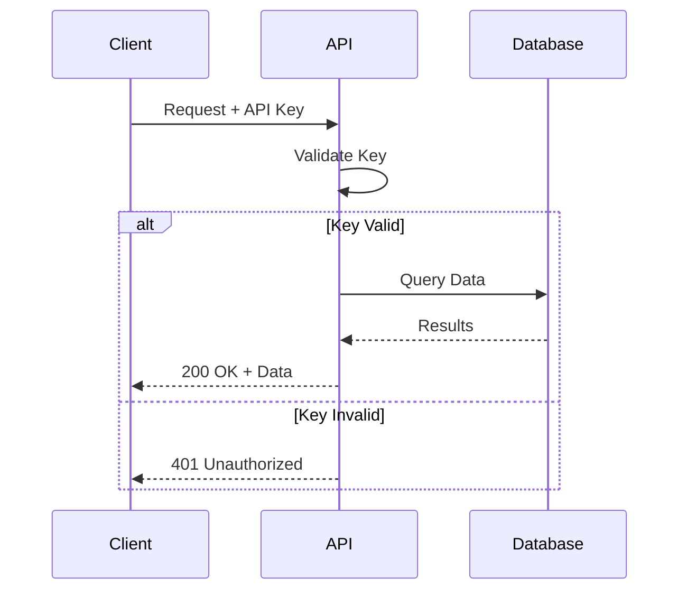
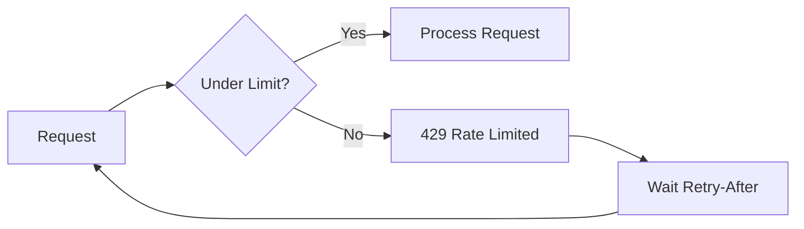

# MartAI Public API Reference

> **Enterprise-grade REST API for programmatic access to your SEO data.**

```
Base URL: https://app.martai.com/api/v1
```

---

## 🚀 Quick Start

Get your first response in 30 seconds:

````carousel
```bash
# cURL
curl -H "Authorization: Bearer mart_YOUR_API_KEY" \
  https://app.martai.com/api/v1/keywords
```
<!-- slide -->
```javascript
// Node.js
const response = await fetch('https://app.martai.com/api/v1/keywords', {
  headers: { Authorization: `Bearer ${MARTAI_API_KEY}` }
});
const { data } = await response.json();
console.log(data.keywords);
```
<!-- slide -->
```python
# Python
import requests

response = requests.get(
    'https://app.martai.com/api/v1/keywords',
    headers={'Authorization': f'Bearer {MARTAI_API_KEY}'}
)
keywords = response.json()['data']['keywords']
```
````

> [!NOTE]
> Need an API key? [Request Access](#request-access) to get started.

---

## 🔐 Authentication



### Methods

| Method                         | Header          | Example                   |
| ------------------------------ | --------------- | ------------------------- |
| **Bearer Token** (recommended) | `Authorization` | `Bearer mart_sk_live_xxx` |
| API Key Header                 | `X-API-Key`     | `mart_sk_live_xxx`        |

### Permission Levels

| Level   | Access               | Use Case            |
| ------- | -------------------- | ------------------- |
| `read`  | GET only             | Dashboards, reports |
| `write` | GET + POST           | Automation, imports |
| `admin` | All + key management | Full control        |

> [!IMPORTANT]
> **Never expose your API key in client-side code.** Store it in environment variables and use server-side requests.

---

## 📦 Response Format

### Success

```json
{
  "success": true,
  "data": {
    /* Your requested data */
  },
  "meta": {
    "requestId": "req_1702123456_abc123",
    "timestamp": "2024-12-09T12:00:00.000Z"
  }
}
```

### Error

```json
{
  "success": false,
  "error": {
    "code": "validation_error",
    "message": "Keywords array cannot be empty",
    "details": { "field": "keywords", "minimum": 1 }
  },
  "meta": { "requestId": "req_xxx" }
}
```

### Error Codes

| Code               | HTTP | Description              | Action                        |
| ------------------ | ---- | ------------------------ | ----------------------------- |
| `unauthorized`     | 401  | Invalid/missing API key  | Check your key                |
| `forbidden`        | 403  | Insufficient permissions | Request higher access         |
| `not_found`        | 404  | Resource doesn't exist   | Verify the ID                 |
| `rate_limited`     | 429  | Too many requests        | Wait per `Retry-After` header |
| `validation_error` | 400  | Invalid input            | Check `details` field         |
| `internal_error`   | 500  | Server error             | Retry with backoff            |

---

## 📍 Endpoints

### Keywords

<details open>
<summary><strong>GET /keywords</strong> — List all keywords</summary>

**Query Parameters:**

| Param    | Type | Default | Description              |
| -------- | ---- | ------- | ------------------------ |
| `limit`  | int  | 50      | Items per page (max 100) |
| `offset` | int  | 0       | Pagination offset        |

**Response Fields:**

| Field        | Type   | Description            |
| ------------ | ------ | ---------------------- |
| `_id`        | string | Unique identifier      |
| `keyword`    | string | The keyword text       |
| `volume`     | number | Monthly search volume  |
| `difficulty` | number | SEO difficulty (0-100) |
| `cpc`        | number | Cost per click ($)     |
| `createdAt`  | number | Unix timestamp         |

**Example:**

```bash
curl "https://app.martai.com/api/v1/keywords?limit=25" \
  -H "Authorization: Bearer mart_YOUR_API_KEY"
```

```json
{
  "success": true,
  "data": {
    "keywords": [
      {
        "_id": "j971pz2dwq4z...",
        "keyword": "best seo tools 2024",
        "volume": 12000,
        "difficulty": 45,
        "cpc": 2.5,
        "createdAt": 1702123456789
      }
    ],
    "pagination": { "total": 150, "limit": 25, "offset": 0, "hasMore": true }
  }
}
```

</details>

<details>
<summary><strong>POST /keywords</strong> — Create keywords (requires <code>write</code>)</summary>

**Request Body:**

```json
{ "keywords": ["seo tools", "keyword research", "content strategy"] }
```

**Limits:**

- Min: 1 keyword
- Max: 100 keywords per request
- Max 200 characters per keyword

**Example:**

```bash
curl -X POST "https://app.martai.com/api/v1/keywords" \
  -H "Authorization: Bearer mart_YOUR_API_KEY" \
  -H "Content-Type: application/json" \
  -d '{"keywords": ["seo tips", "keyword research"]}'
```

```json
{
  "success": true,
  "data": { "created": ["j971pz2...", "k082qa3..."], "count": 2 }
}
```

</details>

---

### Clusters

<details>
<summary><strong>GET /clusters</strong> — List keyword clusters</summary>

**Response Fields:**

| Field           | Type   | Description           |
| --------------- | ------ | --------------------- |
| `_id`           | string | Cluster ID            |
| `name`          | string | Cluster/topic name    |
| `keywordCount`  | number | Keywords in cluster   |
| `avgVolume`     | number | Average search volume |
| `avgDifficulty` | number | Average difficulty    |
| `status`        | string | `active` / `archived` |

**Example:**

```bash
curl "https://app.martai.com/api/v1/clusters" \
  -H "Authorization: Bearer mart_YOUR_API_KEY"
```

</details>

---

### Briefs

<details>
<summary><strong>GET /briefs</strong> — List content briefs</summary>

**Query Parameters:**

| Param    | Type   | Options                                           |
| -------- | ------ | ------------------------------------------------- |
| `status` | string | `planned`, `in_progress`, `approved`, `published` |
| `limit`  | int    | 1-100 (default 50)                                |

**Response Fields:**

| Field           | Type   | Description          |
| --------------- | ------ | -------------------- |
| `_id`           | string | Brief ID             |
| `title`         | string | Article title        |
| `status`        | string | Current status       |
| `scheduledDate` | number | Planned publish date |
| `h2Outline`     | array  | Section headings     |
| `metaTitle`     | string | SEO meta title       |

**Example:**

```bash
curl "https://app.martai.com/api/v1/briefs?status=approved" \
  -H "Authorization: Bearer mart_YOUR_API_KEY"
```

</details>

---

### Analytics

<details>
<summary><strong>GET /analytics</strong> — Get KPI summary</summary>

**Query Parameters:**

| Param  | Type | Default | Range |
| ------ | ---- | ------- | ----- |
| `days` | int  | 30      | 1-90  |

**Response Fields:**

| Field         | Type   | Description            |
| ------------- | ------ | ---------------------- |
| `sessions`    | number | Total GA4 sessions     |
| `clicks`      | number | GSC clicks             |
| `impressions` | number | GSC impressions        |
| `ctr`         | number | Click-through rate (%) |
| `avgPosition` | number | Average SERP position  |
| `leads`       | number | Leads generated        |
| `revenue`     | number | Revenue ($)            |

**Example:**

```bash
curl "https://app.martai.com/api/v1/analytics?days=7" \
  -H "Authorization: Bearer mart_YOUR_API_KEY"
```

</details>

---

## ⏱️ Rate Limits



| Plan       | Requests/min | Headers                                                           |
| ---------- | ------------ | ----------------------------------------------------------------- |
| Enterprise | 100          | `X-RateLimit-Limit`, `X-RateLimit-Remaining`, `X-RateLimit-Reset` |

**Handling rate limits:**

```javascript
async function fetchWithRetry(url, options, maxRetries = 3) {
  for (let i = 0; i < maxRetries; i++) {
    const response = await fetch(url, options);
    if (response.status !== 429) return response;

    const retryAfter = response.headers.get('Retry-After') || 60;
    await new Promise((r) => setTimeout(r, retryAfter * 1000));
  }
  throw new Error('Max retries exceeded');
}
```

---

## 🔒 Security Headers

All responses include:

| Header                      | Value              | Purpose               |
| --------------------------- | ------------------ | --------------------- |
| `Strict-Transport-Security` | `max-age=31536000` | Force HTTPS           |
| `X-Content-Type-Options`    | `nosniff`          | Prevent MIME sniffing |
| `X-Frame-Options`           | `DENY`             | Prevent clickjacking  |
| `X-Request-ID`              | `req_xxx`          | Request tracing       |
| `X-MartAI-Version`          | `2024-12-01`       | API version           |

---

## 🌐 CORS

All endpoints support Cross-Origin Resource Sharing:

```http
Access-Control-Allow-Origin: *
Access-Control-Allow-Methods: GET, POST, PUT, DELETE, OPTIONS
Access-Control-Allow-Headers: Authorization, X-API-Key, Content-Type, Idempotency-Key
```

---

## 💻 SDK Examples

### Node.js

```javascript
const MARTAI_API_KEY = process.env.MARTAI_API_KEY;
const BASE_URL = 'https://app.martai.com/api/v1';

class MartAI {
  async getKeywords(options = {}) {
    const params = new URLSearchParams(options);
    const response = await fetch(`${BASE_URL}/keywords?${params}`, {
      headers: { Authorization: `Bearer ${MARTAI_API_KEY}` },
    });
    const { success, data, error } = await response.json();
    if (!success) throw new Error(error.message);
    return data;
  }

  async createKeywords(keywords) {
    const response = await fetch(`${BASE_URL}/keywords`, {
      method: 'POST',
      headers: {
        Authorization: `Bearer ${MARTAI_API_KEY}`,
        'Content-Type': 'application/json',
      },
      body: JSON.stringify({ keywords }),
    });
    const { success, data, error } = await response.json();
    if (!success) throw new Error(error.message);
    return data;
  }
}
```

### Python

```python
import requests
import os

class MartAI:
    def __init__(self):
        self.api_key = os.environ.get('MARTAI_API_KEY')
        self.base_url = 'https://app.martai.com/api/v1'
        self.headers = {'Authorization': f'Bearer {self.api_key}'}

    def get_keywords(self, limit=50, offset=0):
        response = requests.get(
            f'{self.base_url}/keywords',
            headers=self.headers,
            params={'limit': limit, 'offset': offset}
        )
        data = response.json()
        if not data['success']:
            raise Exception(data['error']['message'])
        return data['data']

    def create_keywords(self, keywords: list):
        response = requests.post(
            f'{self.base_url}/keywords',
            headers={**self.headers, 'Content-Type': 'application/json'},
            json={'keywords': keywords}
        )
        data = response.json()
        if not data['success']:
            raise Exception(data['error']['message'])
        return data['data']
```

---

## 📝 Request Access

> [!IMPORTANT]
> API access is available for **Enterprise** customers.

To request API access:

1. [Submit the API Access Request Form](https://app.martai.com/api-access)
2. Our team reviews your use case (24-48 hours)
3. Upon approval, you'll receive your API credentials

**What we need:**

- Company name and website
- Expected use case (BI integration, automation, etc.)
- Estimated monthly API calls

---

## 📜 Changelog

| Version | Date     | Changes                                                |
| ------- | -------- | ------------------------------------------------------ |
| v1.0.0  | Dec 2024 | Initial release: keywords, clusters, briefs, analytics |

---

## 🆘 Support

| Channel       | Contact                                    |
| ------------- | ------------------------------------------ |
| Email         | api-support@martai.com                     |
| Documentation | [docs.martai.com](https://docs.martai.com) |
| Dashboard     | [app.martai.com](https://app.martai.com)   |
