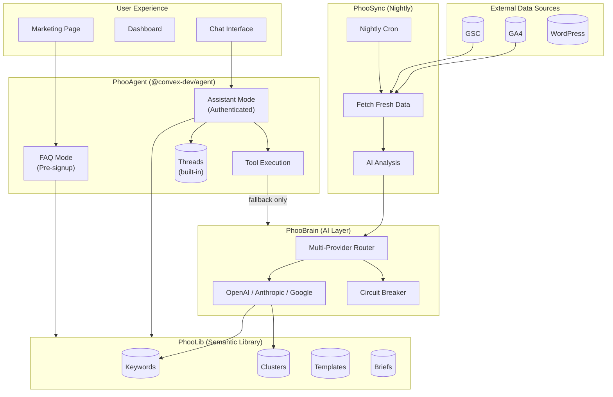
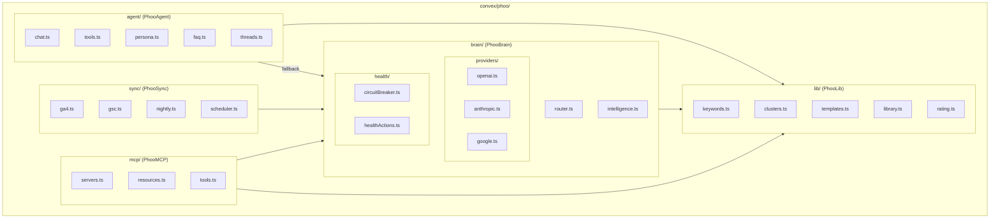
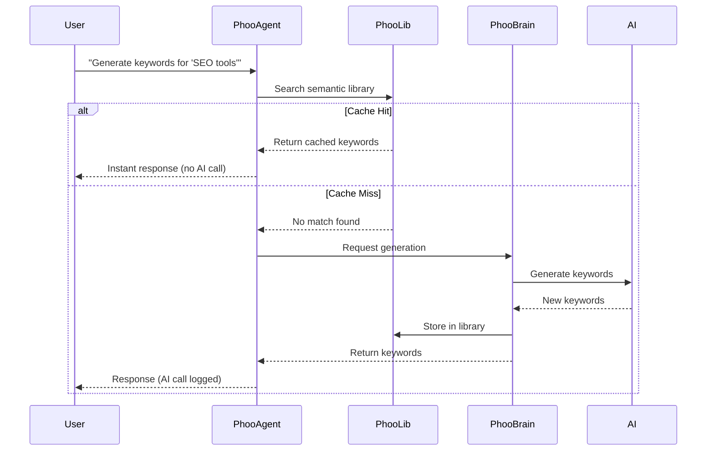
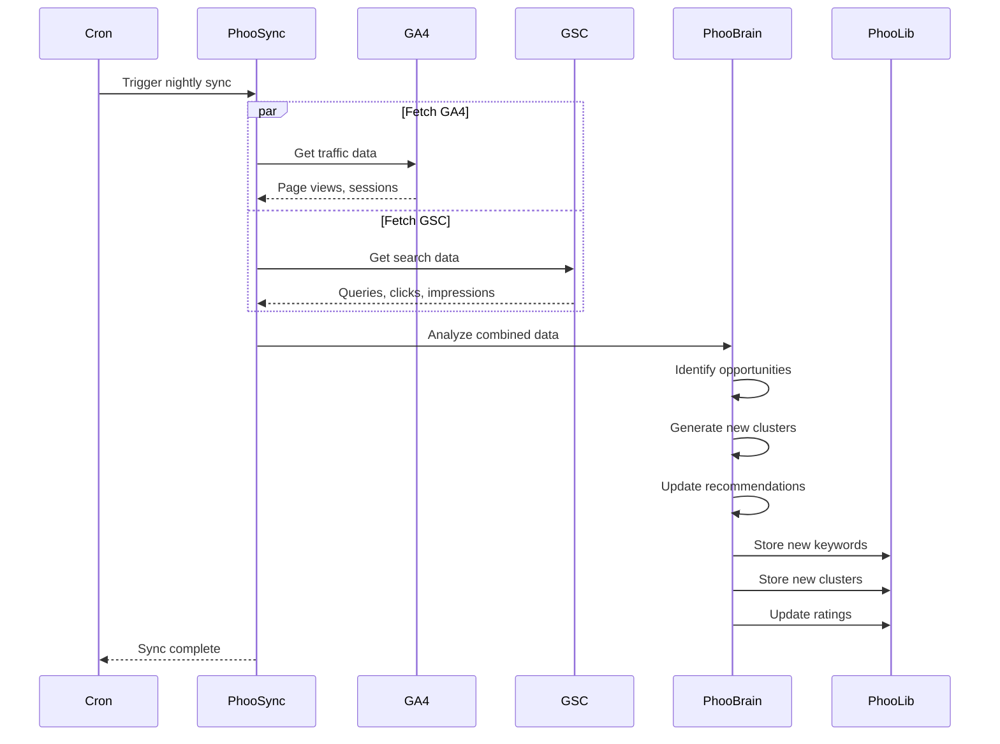

# Phoo Intelligence Layer Architecture

## Executive Summary

This document defines the architecture for Phoo's intelligence layer. The core philosophy: **AI builds the library, the library serves the users.**

> [!IMPORTANT]
> AI calls should only happen during nightly syncs with GA4/GSC. All user-facing operations serve from the pre-computed semantic library (PhooLib).

---

## Existing Infrastructure

We already have these Convex components installed and configured:

| Component                  | Status       | Location                      |
| -------------------------- | ------------ | ----------------------------- |
| `@convex-dev/agent`        | ✅ Installed | `convex.config.ts` line 9, 18 |
| `@convex-dev/rag`          | ✅ Installed | `convex.config.ts` line 5, 15 |
| `@convex-dev/rate-limiter` | ✅ Installed | `convex.config.ts` line 2, 12 |
| `@convex-dev/workflow`     | ✅ Installed | `convex.config.ts` line 4, 14 |
| `seoAgent`                 | ✅ Defined   | `convex/ai/seoAgent.ts`       |

The `@convex-dev/agent` component provides:

- Thread management (built-in)
- Message persistence (automatic)
- Vector search for context
- RAG integration
- Tool calling
- Streaming over websockets
- Usage tracking
- Rate limiting

**We don't need to build PhooAgent from scratch. We extend the existing `seoAgent` and rename it to Phoo.**

---

## System Overview



---

## User Flow Architecture

```mermaid
flowchart LR
    subgraph Unauthenticated["Unauthenticated User"]
        LAND["Landing Page"]
        LEARN["Learn About Phoo"]
    end

    subgraph PhooFAQ["Phoo FAQ Mode"]
        ASK["Ask Question"]
        SCRIPT["Scripted Responses"]
        EXAMPLES["View Examples"]
    end

    subgraph Signup["Signup Flow"]
        PAY["Payment"]
        ONBOARD["Onboarding"]
    end

    subgraph NoIntegration["No GA4/GSC"]
        GENERIC["Generic PhooLib"]
        LOW_PR["Phoo Rating: 40%"]
        NUDGE["Nudge to Integrate"]
    end

    subgraph WithIntegration["With GA4/GSC"]
        PERSONAL["Personalized PhooLib"]
        HIGH_PR["Phoo Rating: 85%"]
        FULL["Full Features"]
    end

    LAND --> LEARN
    LEARN --> PhooFAQ
    ASK --> SCRIPT
    SCRIPT --> EXAMPLES
    EXAMPLES -->|"convinced"| PAY
    PAY --> ONBOARD
    ONBOARD -->|"skip integration"| GENERIC
    ONBOARD -->|"connect GA4/GSC"| PERSONAL
    GENERIC --> LOW_PR
    LOW_PR --> NUDGE
    NUDGE -->|"later integrates"| PERSONAL
    PERSONAL --> HIGH_PR
    HIGH_PR --> FULL
```



---

## Phoo Rating System

The Phoo Rating (PR) is a 0-100 score that gamifies engagement and drives integration:

| Score  | Status    | Description                                    |
| ------ | --------- | ---------------------------------------------- |
| 0-40   | Generic   | No integrations, using industry baselines      |
| 40-70  | Growing   | Some data, limited personalization             |
| 70-100 | Optimized | Full integration, personalized recommendations |

### Rating Factors

| Factor             | Points | Description                   |
| ------------------ | ------ | ----------------------------- |
| GA4 Connected      | +20    | Traffic data available        |
| GSC Connected      | +20    | Search data available         |
| Keywords Seeded    | +15    | Initial keyword research done |
| Clusters Generated | +15    | Topic clusters created        |
| Content Calendar   | +15    | 1-month calendar exists       |
| Fresh Sync (<24h)  | +10    | Data is current               |
| Brief Generated    | +5     | At least one brief created    |

---

## Component Architecture



---

## Data Flow: Cache-First AI



---

## Nightly Sync Flow



---

## Nomenclature Reference

| Name            | Purpose                    | Directory                   | Layer        |
| --------------- | -------------------------- | --------------------------- | ------------ |
| **PhooLib**     | Semantic knowledge library | `convex/phoo/lib/`          | Data         |
| **PhooBrain**   | AI processing and routing  | `convex/phoo/brain/`        | Intelligence |
| **PhooAgent**   | Chat interface and tools   | `convex/phoo/agent/`        | Interface    |
| **PhooSync**    | External integrations      | `convex/phoo/sync/`         | Integration  |
| **PhooMCP**     | Model Context Protocol     | `convex/phoo/mcp/`          | Extension    |
| **Phoo Rating** | User engagement score      | `convex/phoo/lib/rating.ts` | Gamification |

---

## Directory Structure

```
convex/phoo/
├── lib/                     # PhooLib: Semantic Knowledge
│   ├── keywords.ts          # Keyword CRUD and search
│   ├── clusters.ts          # Topic cluster management
│   ├── templates.ts         # Content calendar templates
│   ├── briefs.ts            # Brief storage and retrieval
│   ├── library.ts           # Main library interface
│   ├── rating.ts            # Phoo Rating calculation
│   └── seed.ts              # Initial data seeding
│
├── brain/                   # PhooBrain: AI Processing
│   ├── router.ts            # Multi-provider routing
│   ├── intelligence.ts      # IntelligenceService
│   ├── providers/
│   │   ├── types.ts
│   │   ├── openai.ts
│   │   ├── anthropic.ts
│   │   ├── google.ts
│   │   └── index.ts
│   └── health/
│       ├── circuitBreaker.ts
│       └── healthActions.ts
│
├── agent/                   # PhooAgent: Conversation
│   ├── chat.ts              # Message handling
│   ├── tools.ts             # Tool definitions
│   ├── persona.ts           # Phoo personality
│   ├── faq.ts               # Pre-signup FAQ mode
│   └── threads.ts           # Conversation threads
│
├── sync/                    # PhooSync: Integrations
│   ├── ga4.ts               # Google Analytics sync
│   ├── gsc.ts               # Search Console sync
│   ├── nightly.ts           # Nightly cron logic
│   └── scheduler.ts         # Sync scheduling
│
└── mcp/                     # PhooMCP: MCP Servers
    ├── servers.ts           # MCP server definitions
    ├── resources.ts         # Resource providers
    └── tools.ts             # MCP tool handlers
```

---

## PhooAgent Modes

### FAQ Mode (Pre-signup)

```typescript
// Strict business logic, no AI generation
const FAQ_RESPONSES = {
  'what is phoo': 'Phoo is your AI SEO assistant...',
  pricing: 'Plans start at $49/month...',
  'how it works': 'Connect your GA4/GSC and Phoo analyzes...',
};
```

- Only serves predefined responses
- Shows examples of what authenticated users get
- Cannot execute any tools
- Drives toward signup

### Assistant Mode (Authenticated)

```typescript
// Full agent capabilities
const tools = [generateKeywords, generateBrief, createContentCalendar, analyzeCompetitors];
```

- Full access to PhooLib
- Can execute tools
- Personalized to user's project
- Uses Phoo Rating to nudge integrations

---

## Security Considerations

Per `/security-rules`:

- [ ] All agent mutations require authentication
- [ ] FAQ mode has no mutations, only queries
- [ ] Rate limiting on all AI operations
- [ ] No PII in logs
- [ ] Tool execution requires project ownership validation

---

## Migration Strategy

Per KHANH's guidance: **Incremental, not big-bang.**

### Current → Target Mapping

| Current Location                      | Target Location                     | Phase |
| ------------------------------------- | ----------------------------------- | ----- |
| `convex/ai/providers/`                | `convex/phoo/brain/providers/`      | 4     |
| `convex/ai/health/`                   | `convex/phoo/brain/health/`         | 4     |
| `convex/ai/router/`                   | `convex/phoo/brain/`                | 4     |
| `convex/seo/library.ts`               | `convex/phoo/lib/keywords.ts`       | 3     |
| `convex/lib/services/intelligence.ts` | `convex/phoo/brain/intelligence.ts` | 4     |
| (new)                                 | `convex/phoo/agent/`                | 2     |
| (new)                                 | `convex/phoo/lib/rating.ts`         | 3     |

### Re-export Strategy

During migration, old paths re-export from new locations:

```typescript
// convex/ai/providers/index.ts (during transition)
export * from '../phoo/brain/providers';
```

This allows gradual migration without breaking imports.

---

## Implementation Phases

### Phase 1: Documentation ✅

- [x] Architecture diagrams
- [x] Nomenclature definition
- [x] Directory structure design
- [ ] Board approval

### Phase 2: PhooAgent Foundation

- [ ] Create `convex/phoo/agent/` directory
- [ ] Implement chat.ts with @convex-dev/agent
- [ ] Build faq.ts for pre-signup mode
- [ ] Connect to existing IntelligenceService
- [ ] Add frontend chat component

### Phase 3: PhooLib + Rating

- [ ] Create `convex/phoo/lib/` directory
- [ ] Move keyword library to new location
- [ ] Implement Phoo Rating calculation
- [ ] Add template storage
- [ ] Display rating in UI

### Phase 4: PhooBrain Migration

- [ ] Move existing AI infrastructure
- [ ] Update import paths
- [ ] Verify router and health checks
- [ ] Add re-exports for backward compatibility

### Phase 5: PhooSync Enhancement

- [ ] Enhance nightly sync with AI analysis
- [ ] Store results in PhooLib
- [ ] Implement cache-first pattern
- [ ] Add sync status to dashboard

---

## Success Metrics

| Metric                  | Target  | Measurement            |
| ----------------------- | ------- | ---------------------- |
| AI calls per user       | <5/week | PhooBrain logs         |
| Cache hit rate          | >80%    | PhooLib analytics      |
| Phoo Rating avg         | >60     | User table aggregation |
| GA4/GSC integration     | >70%    | Onboarding completion  |
| FAQ → Signup conversion | >15%    | Funnel analytics       |

---

## Appendix: Board Consultation

| Persona         | Input                                  | Confidence |
| --------------- | -------------------------------------- | ---------- |
| **ALEX (CEO)**  | "Cache-first AI is our moat."          | 0.9        |
| **BILL (CFO)**  | "Unit economics improve dramatically." | 0.85       |
| **CLARA (CMO)** | "Phoo Rating creates urgency."         | 0.9        |
| **TYLER (CTO)** | "Architecture is sound."               | 0.85       |
| **KHANH (Eng)** | "Incremental migration is safer."      | 0.8        |
| **CONVEX**      | "Use @convex-dev/agent."               | 0.9        |

**Overall Confidence: 0.85**
