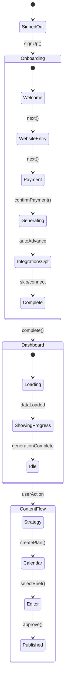

# LDD: Phoo Seamless User Flow Architecture

## Board Review: Ensuring UX/UI Flow is Intuitive, Non-Blocking & Auto-Generating

**Context**: Users currently experience friction and confusion in the app flow. We need a strict user flow guideline that makes users feel knowledgeable, in control, but also "along for the ride" with auto-generation happening seamlessly.

---

## Executive Summary

This LDD defines the **"Guided Autopilot"** pattern: a user flow where Phoo handles complex operations automatically while keeping users informed and in control. The user never guesses what to do next — the layout suggests, the system generates, and the user approves.

---

## Board of Directors Consultation

### C-Suite Leadership

#### ALEX (CEO) says:

> "This is the core product experience. Users who feel lost churn. Users who feel like magic is happening stay. We need the 'Duolingo effect' — progress feels automatic but achievements feel earned. This is P0."

#### BILL (CFO) says:

> "Time-to-value is our most critical metric. If onboarding takes >5 minutes or users drop off before seeing generated content, we're burning CAC. The goal is 'signup → value' in <3 minutes. Measure every step."

#### CLARA (CMO) says:

> "The messaging should be 'Phoo does the work, you make the decisions.' Users want to feel smart, not replaced. Every auto-generated item should have a 'Review' CTA, not just 'Accept.' Brand voice: helpful guide, not overbearing automation."

#### OSCAR (COO) says:

> "We need clear ownership at each step. Who owns the loading state? Who owns the redirect? Document every handoff. At 10x scale, unclear ownership = bugs. Create a flow state machine."

#### TYLER (CTO) says:

> "Fire-and-forget background generation is critical but we need status tracking. Use Convex's reactive queries to show real-time generation progress. No polling. Architecture: optimistic UI + background actions + real-time updates."

---

### Product & Engineering

#### KATE (Product Owner) says:

> "Story: 'As a new user, I sign up, enter my website, and within 2 minutes see a generated content strategy — without clicking 10 buttons.' This is P0 for launch. All onboarding friction is P0."

#### PAIGE (Product Manager) says:

> "The problem: users have 'blank page anxiety' — they don't know what to do first. The solution: Phoo fills the blank pages automatically. Success metric: 0 empty states visible to first-time users after onboarding."

#### KHANH (Director of Engineering) says:

> "The flow should be a finite state machine — no ambiguous states. Every page should know: (1) what the user just did, (2) what Phoo is doing now, (3) what the user should do next. Implement this as a centralized `useAppState` hook."

#### SAM (QA Engineer) says:

> "Test every edge case: What if generation fails mid-flow? What if user navigates away during background generation? What if user clicks 'Next' before generation completes? Each must have graceful handling. No hanging spinners."

#### THEO (TypeScript Wizard) says:

> "Define strict types for each flow state. Use discriminated unions: `type FlowState = { state: 'idle' } | { state: 'generating', progress: number } | { state: 'complete', result: T } | { state: 'error', message: string }`. No ambiguous states."

#### CONVEX (Platform Expert) says:

> "Use Convex subscriptions for real-time progress. Store generation status in the project document. Frontend subscribes to project changes and updates UI reactively. No polling, no manual refresh."

---

### Design & GTM

#### MART (SEO Expert) says:

> "Users come to us because SEO is hard and time-consuming. If our flow feels hard and time-consuming, we've failed. Every auto-generation should save the user at least 30 minutes of manual work. Make the time savings visible: 'Phoo just saved you ~2 hours.'"

#### LAURA (UI/UX Designer) says:

> "This is about Nielsen's #1: Visibility of System Status. At every moment, users should see:
>
> 1. **Where they are** in the flow (progress indicator)
> 2. **What Phoo is doing** (loading states with specific messages)
> 3. **What happens next** (clear CTA)
>
> Never show a blank page. Never show a generic spinner. Never leave users waiting without explanation."

#### BARRY (Sales Manager) says:

> "Demo flow is critical. When I show this to prospects, I need 'wow moments' every 30 seconds. The auto-generation should feel like magic. 'Watch this — I enter a URL and boom, full content strategy.' That's what sells."

---

## The "Guided Autopilot" Pattern

### Core Principles

| Principle                 | Implementation                                                                |
| ------------------------- | ----------------------------------------------------------------------------- |
| **Never Blank**           | Every page has a loading state, empty state with CTA, or content              |
| **Always Progress**       | User sees progress at all times (phase indicator, generation %)               |
| **Confirm, Don't Demand** | "Review your keywords" not "Enter your keywords"                              |
| **Explain the Wait**      | "Phoo is analyzing 50 pages on your site (~30 seconds)" not just "Loading..." |
| **Celebrate Milestones**  | Confetti, badges, Phoo congratulations at key moments                         |
| **Soft Gating**           | Locked features show what they do + unlock requirements                       |

---

## Existing Infrastructure Audit

### Database Schema (54 Tables)

The following tables are already implemented in `convex/schema.ts`:

**Core User/Auth:**

- `users` - Extended with `onboardingStatus`, `onboardingSteps`, `engagementMilestones`
- `subscriptions` - Stripe integration
- `organizations` - Team support
- `teamMembers` - Organization membership

**Project & Content:**

- `projects` - Per-user projects (needs `generationStatus` field)
- `keywordClusters` - AI-generated topic clusters
- `quarterlyPlans` - Content velocity plans
- `briefs` - Content outlines
- `drafts` - Generated article content
- `contentCalendars` - Publishing schedule
- `contentTemplates` - Brief generation templates

**Integrations:**

- `ga4Connections` - Google Analytics 4
- `gscConnections` - Google Search Console
- `platformConnections` - WordPress/publishing

**SEO Data:**

- `keywords` - Individual keywords
- `keywordLibrary` - Pre-seeded keywords
- `analyticsData` - Traffic metrics
- `projectScores` - MR Rating history
- `serpAnalyses` - SERP analysis results

### Existing UI Components

| Component           | Location                     | Purpose                  | LDD Match        |
| ------------------- | ---------------------------- | ------------------------ | ---------------- |
| `EmptyState`        | `src/components/feedback/`   | Page-level empty states  | ✅ Exists        |
| `CompactEmptyState` | `src/components/feedback/`   | Card-level empty         | ✅ Exists        |
| `LoadingEmptyState` | `src/components/feedback/`   | Spinner with message     | ⚠️ Generic       |
| `LoadingState`      | `src/components/shared/`     | Full-page spinner        | ⚠️ Generic       |
| `NextStepCTA`       | `src/components/Navigation/` | Floating next step       | ✅ Exists        |
| `NextStepInline`    | `src/components/Navigation/` | Inline next step         | ✅ Exists        |
| `MartGuide`         | `src/components/mart/`       | Phoo mascot guide        | ✅ Exists        |
| `ProcessingStep`    | `src/components/onboarding/` | Onboarding generating UI | ⚠️ Static badges |

### Existing Hooks

| Hook             | Location               | Purpose                  | LDD Match |
| ---------------- | ---------------------- | ------------------------ | --------- |
| `useUserPhase`   | `lib/useUserPhase.ts`  | Calculate user phase 1-6 | ✅ Exists |
| `getNextStepCTA` | `lib/useUserPhase.ts`  | Get next action per page | ✅ Exists |
| `useFirstVisit`  | `src/components/mart/` | Track first page visits  | ✅ Exists |

### Gap Analysis: What Needs to Be Built

| Requirement                    | Status     | Notes                                 |
| ------------------------------ | ---------- | ------------------------------------- | ------------ | ---------- | ------- |
| `generationStatus` in projects | ❌ Missing | Add to schema: `idle`                 | `generating` | `complete` | `error` |
| Real-time generation progress  | ❌ Missing | Subscribe to project changes          |
| `GeneratingBanner`             | ❌ Missing | Shows progress during generation      |
| `SmartEmptyState`              | ⚠️ Partial | Exists but not context-aware          |
| `PhaseProgress` sidebar widget | ❌ Missing | Visual phase indicator                |
| Confetti celebration           | ⚠️ Partial | Have `canvas-confetti`, need triggers |
| Onboarding step 4 progress     | ⚠️ Partial | `ProcessingStep` exists but static    |
| `useFlowState` hook            | ❌ Missing | Centralized flow state machine        |

---

## User Flow State Machine



---

## Flow States & UI Requirements

### 1. Onboarding Flow

| Step              | State        | User Sees                                                              | Phoo Does                              | Next Action             |
| ----------------- | ------------ | ---------------------------------------------------------------------- | -------------------------------------- | ----------------------- |
| 1. Welcome        | `idle`       | "Hi! I'm Phoo"                                                         | —                                      | "Get Started"           |
| 2. Website        | `idle`       | "What's your website?"                                                 | —                                      | Enter URL               |
| 3. Payment        | `idle`       | Pricing, Skip option                                                   | —                                      | Pay or Skip             |
| 4. **Generating** | `generating` | Progress: "Analyzing site... Finding keywords... Creating strategy..." | Crawl, Keywords, Clusters, Plan, Brief | Auto-advance after ~60s |
| 5. Integrations   | `idle`       | "Connect GA4/GSC (optional)"                                           | —                                      | Connect or Skip         |
| 6. Complete       | `complete`   | "You're all set!" Confetti                                             | —                                      | "Go to Dashboard"       |

> **CRITICAL**: Step 4 (Generating) must show real-time progress messages. The user watches Phoo work, feeling the value of automation.

### 2. Dashboard Flow

| User Phase     | Dashboard Shows                      | Phoo Says                               | Primary CTA       |
| -------------- | ------------------------------------ | --------------------------------------- | ----------------- |
| Generating     | Skeleton + progress                  | "Still working on your strategy..."     | "View Progress"   |
| Strategy Ready | MR Score, Keywords, Clusters         | "Your strategy is ready! Let's review." | "Review Strategy" |
| Calendar Empty | Keywords + Clusters + empty calendar | "Ready to schedule some content?"       | "Create Calendar" |
| Briefs Ready   | Full dashboard                       | "Time to write! Pick a brief."          | "Start Writing"   |

### 3. Content Creation Flow

```
Strategy Page → "View Outline" on brief → Content Editor
                                           ↓
                                    Auto-load brief content
                                           ↓
                                    "Generate Draft" button
                                           ↓
                                    Draft appears
                                           ↓
                                    "Approve" → Mark complete
```

---

## UI Component Requirements

### 1. Global Progress Indicator

```tsx
// Component: PhaseProgress
// Location: Sidebar (all pages)
// Shows: Current phase, progress bar, next milestone

<PhaseProgress
  currentPhase={3} // Discover
  phaseName="Building Strategy"
  progress={75}
  nextMilestone="Content plan ready"
/>
```

### 2. Generation Status Banner

```tsx
// Component: GeneratingBanner
// Location: Top of page when generation in progress
// Shows: What's happening, estimated time, progress

<GeneratingBanner
  status="Generating keyword clusters..."
  progress={45}
  estimatedTimeRemaining="~20 seconds"
  onViewDetails={() => showDetailedProgress()}
/>
```

### 3. Smart Empty States

```tsx
// Component: SmartEmptyState
// Location: Any page with no data
// Shows: Context-aware message + appropriate CTA

<SmartEmptyState
  context={{
    page: 'calendar',
    phase: 4,
    hasKeywords: true,
    hasClusters: true,
    hasPlan: false,
  }}
  // Auto-determines: "Ready to create your calendar! Phoo has analyzed your clusters."
  // Auto-determines CTA: "Generate Calendar →"
/>
```

### 4. Next Step Card

```tsx
// Component: NextStepCard
// Location: Bottom of every page
// Shows: Clear next action

<NextStepCard
  title="Next Step"
  description="Your keywords are clustered. Let's plan when to publish."
  cta="Create Content Calendar"
  href="/calendar"
  phooMessage="I'll suggest optimal publishing dates based on your keywords."
/>
```

---

## Auto-Generation Triggers

| Trigger                             | What Generates                         | When User Sees Result                     |
| ----------------------------------- | -------------------------------------- | ----------------------------------------- |
| Onboarding Step 3 complete          | Keywords, Clusters, Plan, Brief, Draft | Dashboard load (may still be in progress) |
| User clicks "Generate Clusters"     | Keyword clusters                       | Inline on Strategy page                   |
| User clicks "Create Calendar"       | Quarterly plan                         | Calendar page with items                  |
| User clicks "View Outline" on brief | Brief content (if empty)               | Content Editor with outline               |
| User clicks "Generate Draft"        | Full article draft                     | Content Editor                            |

---

## Loading State Messages

Replace generic "Loading..." with contextual messages:

| Context            | Message                                                    |
| ------------------ | ---------------------------------------------------------- |
| Keyword generation | "Phoo is finding keywords your audience searches for..."   |
| Cluster generation | "Grouping keywords into topic clusters..."                 |
| Plan generation    | "Building your content calendar..."                        |
| Brief generation   | "Creating your content outline..."                         |
| Draft generation   | "Writing your first draft... (This is the creative part!)" |
| Score calculation  | "Calculating your SEO health score..."                     |

---

## Error Recovery Flows

| Error              | User Sees                                                          | Recovery                              |
| ------------------ | ------------------------------------------------------------------ | ------------------------------------- |
| Generation timeout | "This is taking longer than expected. We'll email you when ready." | Background retry + email notification |
| Generation fails   | "Phoo ran into a problem. Trying again..."                         | Auto-retry (3x)                       |
| Network error      | "You're offline. We'll sync when you're back."                     | Queue actions, sync on reconnect      |
| Auth expired       | "Your session expired. Please log in again."                       | Redirect to login, preserve state     |

---

## Implementation Checklist

### Phase 1: Core Flow Infrastructure (P0)

- [ ] Create `useFlowState` hook — centralized flow state machine
- [ ] Create `GeneratingBanner` component with real-time progress
- [ ] Create `SmartEmptyState` component with context-awareness
- [ ] Add generation status field to project schema
- [ ] Implement Convex subscription for generation progress

### Phase 2: Onboarding Polish (P0)

- [ ] Replace onboarding step 4 with animated generation progress
- [ ] Add step-by-step messages during generation
- [ ] Implement auto-advance after generation completes
- [ ] Add confetti celebration on onboarding complete

### Phase 3: Dashboard Intelligence (P1)

- [ ] Dashboard shows generation progress if in progress
- [ ] NextStepCard appears based on current phase
- [ ] PhaseProgress in sidebar shows current position

### Phase 4: Content Flow Streamlining (P1)

- [ ] Strategy → Content Editor seamless transition
- [ ] Auto-load brief content when entering editor
- [ ] Draft generation with inline progress

### Phase 5: Error Resilience (P2)

- [ ] Implement retry logic for all generation actions
- [ ] Add email notification for long-running operations
- [ ] Implement offline queue for actions

---

## Metrics & Success Criteria

| Metric                     | Target     | Measurement                                |
| -------------------------- | ---------- | ------------------------------------------ |
| Time to first value        | <3 minutes | Signup → first generated strategy visible  |
| Onboarding completion rate | >85%       | Users who complete all onboarding steps    |
| Zero blank pages           | 100%       | No user ever sees a blank page             |
| Generation visibility      | 100%       | When generating, user always sees progress |
| Next step clarity          | 100%       | Every page has obvious next action         |

---

## Board Decision

**Decision**: Implement the "Guided Autopilot" pattern as the core UX architecture.

**Rationale**:

- ALEX: Aligns with product vision of "SEO made effortless"
- BILL: Reduces time-to-value, improving LTV:CAC
- LAURA: Follows Nielsen heuristics, especially visibility of system status
- KHANH: Finite state machine approach is maintainable and testable
- PAIGE: Solves "blank page anxiety" problem validated in user research

**Confidence**: 0.92 (High consensus, addresses known pain points)

---

## Appendix: Flow Comparison

### Before (Current) — Confusing

```
User → Dashboard (empty) → ??? → Strategy (empty) → ??? → Calendar (empty)
"What do I do? Where is my data?"
```

### After (Guided Autopilot) — Clear

```
User → Onboarding (generating progress) → Dashboard (strategy visible or generating)
     → NextStepCard → Strategy (with data) → NextStepCard → Calendar (with plan)
"Phoo is handling it. I just review and approve."
```

---

## References

- [Duolingo UX Analysis](https://growth.design/case-studies/duolingo-user-engagement)
- [Linear Product Design Principles](https://linear.app/docs/design-principles)
- [Nielsen's 10 Usability Heuristics](https://www.nngroup.com/articles/ten-usability-heuristics/)
- [WCAG 2.2 AA Guidelines](https://www.w3.org/WAI/WCAG22/Understanding/)

---

_LDD authored with Board of Directors consultation. Last updated: December 29, 2024._
