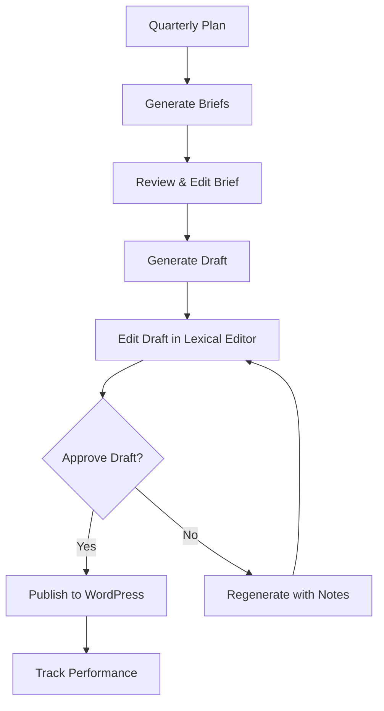
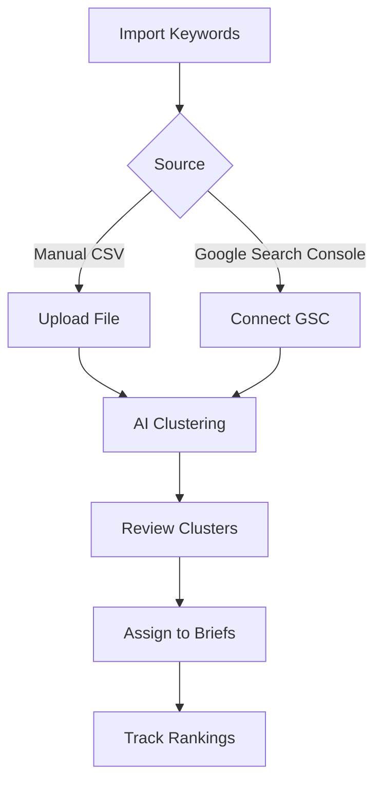
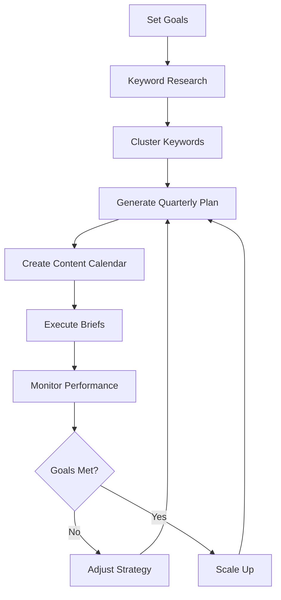
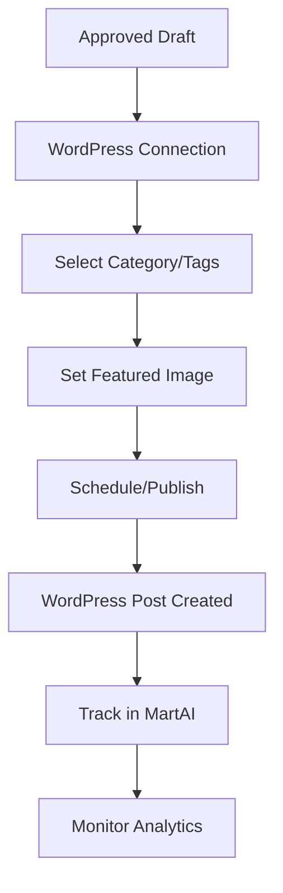
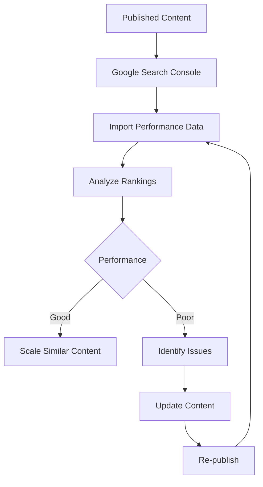
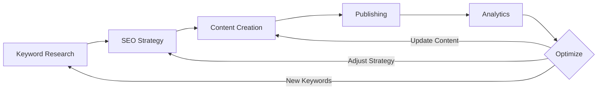

# MartAI Workflows

Complete guide to all workflows and processes in the MartAI SEO content platform.

---

## Table of Contents

1. [Content Creation Workflow](#content-creation-workflow)
2. [Keyword Research Workflow](#keyword-research-workflow)
3. [SEO Strategy Workflow](#seo-strategy-workflow)
4. [Publishing Workflow](#publishing-workflow)
5. [Analytics & Optimization Workflow](#analytics--optimization-workflow)

---

## Content Creation Workflow

The core workflow for creating SEO-optimized content from strategy to publication.

### Overview Diagram



### Step-by-Step Process

#### 1. Create Quarterly Plan

**Location**: `/strategy` page

**Purpose**: Plan your content calendar for the next 12 weeks

**Inputs**:
- Content velocity (posts per week: 1-7)
- Start date
- Traffic goals (optional)
- Leads goals (optional)

**Outputs**:
- 12-week content calendar
- Briefs assigned to keyword clusters
- Traffic/leads projections

**Rate Limits**:
- Free: 1 plan/day
- Starter: 3 plans/day
- Growth: 10 plans/day
- Pro: 30 plans/day
- Admin: 50 plans/day

---

#### 2. Generate Brief

**Location**: `/content?briefId={id}` → "Generate Brief" button

**Purpose**: Create an SEO-optimized content outline

**What It Generates**:
- 3-5 title options optimized for CTR
- H2 outline (main section headings)
- 3-5 FAQs with answers
- Meta title (50-60 chars)
- Meta description (150-160 chars)
- Internal linking suggestions
- Schema markup recommendation

**AI Process**:
1. Analyzes keyword cluster intent
2. Reviews competitor content structure
3. Identifies content gaps
4. Generates SEO-optimized outline
5. Validates against SEO best practices

**Rate Limits**:
- Free: 3 briefs/day
- Starter: 10 briefs/day
- Growth: 30 briefs/day
- Pro: 100 briefs/day
- Admin: 100 briefs/hour

---

#### 3. Review & Edit Brief

**Location**: `/content?briefId={id}` → Brief tab

**Purpose**: Refine the AI-generated outline

**Editable Fields**:
- Title options (add/remove/edit)
- H2 sections (reorder/add/remove)
- FAQs (edit questions/answers)
- Meta tags (optimize for CTR)
- Internal links (add relevant pages)
- Schema type (select appropriate markup)

**SEO Checklist**:
- ✅ Meta title length (50-60 chars)
- ✅ Meta description length (150-160 chars)
- ✅ H2 outline completeness (4+ sections)
- ✅ FAQ inclusion (3+ questions)
- ✅ Internal links (2+ suggestions)

---

#### 4. Generate Draft

**Location**: `/content?briefId={id}` → "Generate Draft" button

**Purpose**: Create full-length content from the brief

**What It Generates**:
- Complete markdown-formatted article
- 800-2000+ word content
- Quality score (0-100)
- Tone score (0-100)
- SEO validation report

**AI Process**:
1. Expands H2 outline into full sections
2. Incorporates keywords naturally
3. Answers FAQs comprehensively
4. Adds internal links contextually
5. Optimizes for readability
6. Validates SEO requirements

**Quality Scoring**:
- **Content Depth**: Comprehensive coverage of topic
- **Keyword Usage**: Natural integration without stuffing
- **Readability**: Clear, scannable structure
- **Value**: Actionable insights and examples

**Tone Scoring**:
- **Brand Voice**: Consistency with industry/audience
- **Professionalism**: Appropriate formality level
- **Engagement**: Compelling and conversational

**Rate Limits**:
- Free: 3 drafts/day
- Starter: 10 drafts/day
- Growth: 30 drafts/day
- Pro: 100 drafts/day
- Admin: 100 drafts/hour

---

#### 5. Edit Draft

**Location**: `/content?briefId={id}` → Draft tab

**Purpose**: Refine and polish the AI-generated content

**Editor Features**:
- **Lexical Rich Text Editor**: WYSIWYG markdown editing
- **Live Preview**: See formatted output in real-time
- **Word Count**: Track content length
- **SEO Checklist**: Real-time validation
- **Quality/Tone Scores**: Monitor content quality

**Regeneration**:
- Add regeneration notes (e.g., "Make more technical", "Add examples")
- Click "Re-generate" to refine with AI
- Previous version is replaced (save manually if needed)

---

#### 6. Approve Draft

**Location**: `/content?briefId={id}` → "Approve Draft" button

**Purpose**: Lock the draft for publication

**What Happens**:
- Draft status changes to "approved"
- Content becomes read-only
- Brief status updates to "ready"
- Draft is ready for publishing

> **Note**: Once approved, drafts cannot be edited. Create a new draft if changes are needed.

---

## Keyword Research Workflow

Discover and organize keywords to target in your content strategy.

### Overview Diagram



### Step-by-Step Process

#### 1. Import Keywords

**Location**: `/seo/keywords` page

**Methods**:

**A. Manual CSV Upload**
- Format: `keyword,volume,difficulty,intent`
- Example:
  ```csv
  seo content strategy,1200,45,informational
  content marketing tools,890,52,commercial
  ```

**B. Google Search Console Integration**
- Connect your GSC property
- Import existing ranking keywords
- Includes impressions, clicks, position data

---

#### 2. Generate Keyword Clusters

**Location**: `/strategy` → "Generate Clusters" button

**Purpose**: Group related keywords using AI

**AI Process**:
1. Analyzes semantic relationships
2. Identifies search intent patterns
3. Groups by topic similarity
4. Calculates cluster impact scores
5. Assigns primary keywords

**Cluster Properties**:
- **Cluster Name**: Topic/theme of the group
- **Keywords**: 5-50 related keywords
- **Intent**: informational, commercial, transactional, navigational
- **Impact Score**: Weighted by volume, difficulty, and relevance
- **Volume Range**: Min/max search volume in cluster

**Rate Limits**:
- Free: 5 clusters/day
- Starter: 15 clusters/day
- Growth: 50 clusters/day
- Pro: 200 clusters/day
- Admin: 200 clusters/hour

---

#### 3. Review & Refine Clusters

**Location**: `/seo/clusters` page

**Actions**:
- **Merge Clusters**: Combine similar topics
- **Split Clusters**: Separate broad topics
- **Edit Keywords**: Add/remove keywords
- **Adjust Intent**: Correct search intent classification
- **Set Priority**: Mark high-value clusters

---

#### 4. Assign to Content Calendar

**Location**: `/strategy` → Quarterly Plan

**Process**:
- Clusters are automatically assigned to briefs
- High-impact clusters prioritized first
- Distribution based on content velocity
- Manual reassignment available

---

## SEO Strategy Workflow

Plan and execute your long-term SEO content strategy.

### Overview Diagram



### Step-by-Step Process

#### 1. Define Goals

**Location**: `/strategy` → "Generate Quarterly Plan" modal

**Goal Types**:
- **Traffic Goals**: Target monthly visitors
- **Leads Goals**: Target conversions/signups
- **Revenue Goals**: Target revenue (future feature)

**Considerations**:
- Current baseline traffic
- Industry benchmarks
- Content velocity capacity
- Keyword difficulty distribution

---

#### 2. Set Content Velocity

**Definition**: Number of posts published per week

**Recommendations**:
- **1-2 posts/week**: Small teams, high-quality focus
- **3-4 posts/week**: Medium teams, balanced approach
- **5-7 posts/week**: Large teams, aggressive growth

**Impact on Plan**:
- 1 post/week = 12 briefs over 12 weeks
- 3 posts/week = 36 briefs over 12 weeks
- 7 posts/week = 84 briefs over 12 weeks

---

#### 3. Generate Quarterly Plan

**AI Process**:
1. Analyzes keyword clusters
2. Estimates traffic potential
3. Calculates conversion projections
4. Distributes clusters across calendar
5. Generates plan summary

**Output**:
- 12-week content calendar
- Brief placeholders with scheduled dates
- Traffic/leads projections
- Strategic assumptions and recommendations

---

#### 4. Execute Content Calendar

**Weekly Workflow**:
1. Review upcoming briefs for the week
2. Generate brief details (if not done)
3. Generate drafts
4. Edit and approve drafts
5. Publish to WordPress
6. Share on social media

**Tracking**:
- Brief status (planned → in_progress → ready → published)
- Draft status (draft → approved)
- Publication dates
- Performance metrics

---

## Publishing Workflow

Publish approved content to WordPress and track performance.

### Overview Diagram



### Step-by-Step Process

#### 1. Connect WordPress

**Location**: `/settings/integrations` → WordPress

**Requirements**:
- WordPress site URL
- Application password (or JWT token)
- REST API enabled

**Permissions Needed**:
- Create/edit posts
- Upload media
- Manage categories/tags

---

#### 2. Publish Draft

**Location**: `/content?briefId={id}` → "Publish" button

**Options**:
- **Status**: Draft, Scheduled, Published
- **Category**: Select from WordPress categories
- **Tags**: Add relevant tags
- **Featured Image**: Upload or select from media library
- **Publish Date**: Immediate or scheduled

**What Happens**:
1. Draft content converted to WordPress format
2. Images uploaded to media library
3. Post created in WordPress
4. Meta tags applied (title, description)
5. Schema markup added (if applicable)
6. Internal links inserted
7. Post ID stored in MartAI

---

#### 3. Track Publication

**Location**: `/content` → Content list

**Tracked Metrics**:
- Publication date
- WordPress post ID
- Post URL
- Status (draft/published/scheduled)
- Last updated timestamp

---

## Analytics & Optimization Workflow

Monitor performance and optimize your content strategy.

### Overview Diagram



### Step-by-Step Process

#### 1. Connect Analytics

**Location**: `/settings/integrations`

**Integrations**:
- **Google Search Console**: Rankings, impressions, clicks
- **Google Analytics**: Traffic, engagement, conversions
- **WordPress**: Publication status, comments

---

#### 2. Import Performance Data

**Frequency**: Daily automatic sync

**Data Collected**:
- **Rankings**: Position for target keywords
- **Impressions**: Search result appearances
- **Clicks**: Organic traffic from search
- **CTR**: Click-through rate
- **Average Position**: Mean ranking across queries

---

#### 3. Analyze Content Performance

**Location**: `/analytics` → Content Performance

**Metrics**:
- **Top Performing**: Highest traffic/conversions
- **Underperforming**: Below expectations
- **Trending Up**: Improving rankings
- **Trending Down**: Declining rankings

**Insights**:
- Keyword cannibalization detection
- Content gap identification
- Optimization opportunities
- Seasonal trends

---

#### 4. AI-Powered Analysis

**Location**: `/analytics` → "Run AI Analysis"

**What It Analyzes**:
- Competitor content strategies
- Backlink opportunities
- Technical SEO issues
- Content freshness needs
- Keyword expansion opportunities

**Rate Limits**:
- Free: 2 reports/day
- Starter: 5 reports/day
- Growth: 15 reports/day
- Pro: 50 reports/day
- Admin: 50 reports/day

---

#### 5. Optimize & Update

**Actions**:
- **Refresh Content**: Update outdated information
- **Expand Content**: Add new sections for related keywords
- **Improve CTR**: Optimize titles and meta descriptions
- **Add Internal Links**: Link to newer related content
- **Update Images**: Replace with higher quality visuals

**Re-publication**:
- Update draft in MartAI
- Re-publish to WordPress
- Track performance improvement

---

## Workflow Integration Map

How all workflows connect together:



---

## Rate Limits Summary

All AI operations are rate-limited to prevent abuse and control costs:

| Operation | Free | Starter | Growth | Pro | Admin |
|-----------|------|---------|--------|-----|-------|
| **Brief Generation** | 3/day | 10/day | 30/day | 100/day | 100/hour |
| **Draft Generation** | 3/day | 10/day | 30/day | 100/day | 100/hour |
| **Keyword Clustering** | 5/day | 15/day | 50/day | 200/day | 200/hour |
| **Quarterly Planning** | 1/day | 3/day | 10/day | 30/day | 50/day |
| **AI Analysis** | 2/day | 5/day | 15/day | 50/day | 50/day |

> **Note**: Admin tier is for internal testing and has generous limits.

---

## Best Practices

### Content Creation
- ✅ Always generate and review briefs before drafts
- ✅ Edit AI-generated content for brand voice
- ✅ Validate SEO checklist before approval
- ✅ Add custom examples and insights
- ✅ Include relevant internal links

### Keyword Research
- ✅ Import from GSC for existing sites
- ✅ Focus on clusters with high impact scores
- ✅ Balance difficulty with volume
- ✅ Align intent with content goals
- ✅ Regular cluster reviews and refinement

### SEO Strategy
- ✅ Set realistic traffic goals
- ✅ Match content velocity to team capacity
- ✅ Prioritize high-impact clusters first
- ✅ Monitor and adjust quarterly
- ✅ Track competitor strategies

### Publishing
- ✅ Schedule posts consistently
- ✅ Optimize featured images for SEO
- ✅ Use descriptive categories and tags
- ✅ Add schema markup when applicable
- ✅ Promote on social channels

### Analytics
- ✅ Review performance weekly
- ✅ Update underperforming content
- ✅ Identify content gaps
- ✅ Track keyword rankings
- ✅ Measure against goals

---

## Troubleshooting

### Common Issues

**Rate Limit Exceeded**
- **Error**: "Rate limit exceeded. Try again in X minutes."
- **Solution**: Wait for the specified time or upgrade your plan
- **Prevention**: Spread AI operations throughout the day

**Brief Generation Failed**
- **Error**: "Brief details not generated."
- **Solution**: Ensure keyword cluster is assigned and has valid data
- **Prevention**: Review cluster quality before generating briefs

**Draft Quality Low**
- **Issue**: Quality score below 60
- **Solution**: Add regeneration notes with specific improvements
- **Prevention**: Ensure brief has comprehensive outline

**WordPress Publishing Failed**
- **Error**: "Failed to publish to WordPress"
- **Solution**: Check WordPress connection and permissions
- **Prevention**: Test connection in settings regularly

---

## Future Workflows

Coming soon:

- **Email Campaign Workflow**: Repurpose content for email marketing
- **Social Media Workflow**: Auto-generate social posts from content
- **Video Script Workflow**: Create YouTube scripts from briefs
- **Podcast Workflow**: Generate podcast outlines and show notes
- **Translation Workflow**: Multi-language content creation

---

## Support

Need help with workflows?

- 📖 [Documentation](https://docs.martai.com)
- 💬 [Community Forum](https://community.martai.com)
- 📧 [Support Email](mailto:support@martai.com)
- 🎥 [Video Tutorials](https://youtube.com/@martai)
