# Phoo Business Logic Document

> **Single Source of Truth** for user flows, Convex workflows, and testing strategy.

---

## 1. User Journey Phases


| Phase        | User Goal         | Convex Functions       | Test Coverage |
| ------------ | ----------------- | ---------------------- | ------------- |
| **Setup**    | Create account    | `auth.*`, `users.me`   | ✅ Tested     |
| **Connect**  | Link GA4/GSC      | `integrations.oauth.*` | ❌ Not tested |
| **Discover** | Find keywords     | `seo.keywords.*`       | ✅ Tested     |
| **Plan**     | Organize clusters | `seo.clusters.*`       | ✅ Tested     |
| **Create**   | Write briefs      | `content.briefs.*`     | ✅ Tested     |
| **Publish**  | Go live           | `publishing.*`         | ❌ Not tested |

---

## 2. Convex Workflows

### 2.1 Core Workflows (`convex/workflows/`)

| Workflow       | Purpose                     | Tested? |
| -------------- | --------------------------- | ------- |
| `m1.ts`        | Milestone 1 onboarding flow | ✅ Yes  |
| `cluster.ts`   | AI cluster generation       | ❌ No   |
| `brief.ts`     | AI brief generation         | ❌ No   |
| `audit.ts`     | SEO site audit              | ❌ No   |
| `analytics.ts` | Analytics sync              | ❌ No   |
| `calendar.ts`  | Calendar scheduling         | ❌ No   |

### 2.2 Function Counts

| Type      | Count   | Tested   | Coverage |
| --------- | ------- | -------- | -------- |
| Queries   | 119     | ~80      | **67%**  |
| Mutations | 114     | ~90      | **79%**  |
| Actions   | 48      | ~28      | **58%**  |
| **Total** | **281** | **~198** | **70%**  |

---

## 3. Security-Critical Functions

> **P0 Priority** - These MUST have tests.

### Data Isolation (RBAC)

- ✅ `projects.getById` - User can only see own projects
- ✅ `keywords.getByProject` - Scoped to project
- ✅ `clusters.getByProject` - Scoped to project
- ✅ `briefs.getByProject` - Scoped to project

### Authentication

- ✅ `auth.signUp` / `auth.signIn`
- ✅ `users.me` - Returns current user only
- ✅ `apiKeys.validate` - Key validation, expiration, revocation

### Authorization

- ✅ `admin.requireAdmin` - Role checks
- ✅ `subscriptions.checkAccess` - Tier limits, usage tracking

---

## 4. Business Rules

### 4.1 Phoo Rating Calculation

```typescript
// Components and Weights
const RATING_COMPONENTS = {
  seoHealth: 35,       // From site audit
  keywordStrategy: 25, // From keyword count + search volume
  contentClusters: 25, // From cluster organization
  contentExecution: 15 // From briefs + calendar
};

// Score Ranges
0-30:  "Needs Work" (red)
30-50: "Fair" (yellow)
50-70: "Good" (blue)
70-85: "Great" (green)
85-100: "Excellent" (purple)
```

### 4.2 Phase Transitions

```typescript
// Phase unlock conditions
Phase 1 → 2: onboardingComplete === true
Phase 2 → 3: hasGSC || hasGA4 || keywordCount > 0
Phase 3 → 4: keywordCount >= 10 && clusterCount >= 1
Phase 4 → 5: scheduledBriefCount >= 1
Phase 5 → 6: publishedArticleCount >= 1
```

### 4.3 Rate Limits

| Endpoint      | Limit | Window   |
| ------------- | ----- | -------- |
| AI Generation | 50    | per day  |
| API Keys      | 1000  | per hour |
| OAuth Refresh | 10    | per hour |

---

## 5. Test Coverage Plan

### P0: Security (Target: 100%)

- [ ] All RBAC checks
- [ ] All authentication flows
- [ ] All rate limit enforcement
- [ ] API key validation

### P1: Core Business Logic (Target: 80%)

- [x] Keywords CRUD
- [x] Clusters CRUD
- [x] Briefs CRUD
- [x] M1 workflow
- [ ] Phoo Rating calculation
- [ ] Phase transitions
- [ ] Subscription access

### P2: Integrations (Target: 50%)

- [ ] OAuth flows (GA4, GSC)
- [ ] WordPress publishing
- [ ] Webhook handlers

### P3: AI Features (Target: 40%)

- [x] Intelligence service
- [ ] Phoo Agent
- [ ] Cluster generation
- [ ] Brief generation

---

## 6. Visual Diagrams

### 6.1 User Journey Flow

```mermaid
flowchart LR
    subgraph Phase1[Phase 1: Setup]
        A[Signup] --> B[Onboarding]
    end

    subgraph Phase2[Phase 2: Connect]
        C[OAuth GA4/GSC]
        D[Manual Skip]
    end

    subgraph Phase3[Phase 3: Discover]
        E[Import Keywords]
        F[Add Keywords]
        G{10+ Keywords?}
    end

    subgraph Phase4[Phase 4: Plan]
        H[Generate Clusters]
        I[Create Calendar]
    end

    subgraph Phase5[Phase 5: Create]
        J[Write Brief]
        K[Schedule Content]
    end

    subgraph Phase6[Phase 6: Publish]
        L[WordPress/Export]
        M[🎉 Live!]
    end

    Phase1 --> Phase2
    Phase2 --> Phase3
    Phase3 --> G
    G -->|Yes| Phase4
    G -->|No| F
    Phase4 --> Phase5
    Phase5 --> Phase6
```



### 6.2 Convex Data Flow


### 6.3 Phoo Rating Calculation


| Score Range | Status     | Color        | Badge Style |
| ----------- | ---------- | ------------ | ----------- |
| 0-30        | Needs Work | `red.500`    | Dark text   |
| 30-50       | Fair       | `yellow.300` | Dark text   |
| 50-70       | Good       | `blue.500`   | White text  |
| 70-85       | Great      | `green.400`  | White text  |
| 85-100      | Excellent  | `purple.500` | White text  |

### 6.4 Test Coverage Map

```mermaid
mindmap
  root((Test Coverage))
    Core Logic ✅
      Keywords
        CRUD
        Security
      Clusters
        CRUD
        Merging
      Briefs
        CRUD
        Scheduling
    Security ✅
      RBAC
        Data Isolation
        Role Hierarchy
      Auth
        SignUp
        SignIn
    AI Features 🔶
      Intelligence Service ✅
      Phoo Agent ❌
      Generators ❌
    Integrations ❌
      OAuth
      WordPress
      Webhooks
```



### 6.5 Reference Documents

| Diagram              | Document                                                            |
| -------------------- | ------------------------------------------------------------------- |
| User Flow (detailed) | [USER_FLOW_LDD.md](../project/USER_FLOW_LDD.md)                     |
| Intelligence Layer   | [LDD_PHOO_INTELLIGENCE_LAYER.md](../LDD_PHOO_INTELLIGENCE_LAYER.md) |
| Multi-Agent AI       | [LDD_MULTI_AGENT_AI.md](../LDD_MULTI_AGENT_AI.md)                   |

---

## 7. Consistency Rules

### Naming Conventions

- **Queries**: `get*`, `list*`, `search*`
- **Mutations**: `create*`, `update*`, `delete*`, `set*`
- **Actions**: `generate*`, `sync*`, `send*`, `fetch*`

### Error Handling

- All mutations must validate input with Zod
- All queries must check user authorization
- All actions must handle timeouts gracefully

### Data Flow

```
User → Frontend → Convex Query/Mutation → Database
                         ↓
               Convex Action → External API
```

---

## 8. References

| Document                                                            | Purpose               |
| ------------------------------------------------------------------- | --------------------- |
| [USER_FLOW_LDD.md](../project/USER_FLOW_LDD.md)                     | User journey phases   |
| [SECURITY_POLICY.md](SECURITY_POLICY.md)                            | Security requirements |
| [LDD_PHOO_INTELLIGENCE_LAYER.md](../LDD_PHOO_INTELLIGENCE_LAYER.md) | AI architecture       |
| [LAURA_PERSONA.md](../personas/LAURA_PERSONA.md)                    | UX guidelines         |

---

Last Updated: 2025-12-28
