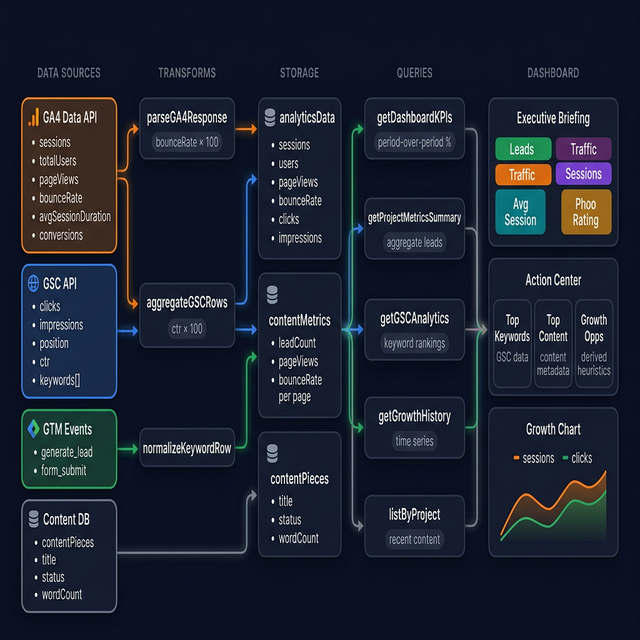
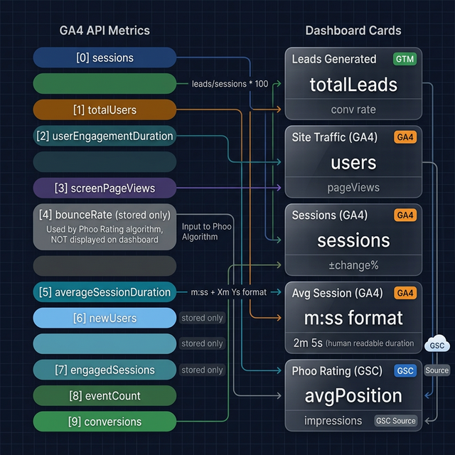

# Analytics Architecture Reference

The complete data flow from Google APIs to every dashboard element, with color-coded data source tracking.

---

## Data Source Color Legend

| Badge       | Color            | Source                | What It Tracks                                                          |
| ----------- | ---------------- | --------------------- | ----------------------------------------------------------------------- |
| **GA4**     | Orange `#F99F2A` | Google Analytics 4    | Sessions, users, pageViews, avgSessionDuration, bounceRate, conversions |
| **GSC**     | Blue `#60a5fa`   | Google Search Console | Clicks, impressions, position, CTR, keywords                            |
| **GTM**     | Green `#22C55E`  | Google Tag Manager    | generate_lead events, form submissions                                  |
| **Content** | Gray `#94a3b8`   | Convex contentPieces  | Title, status, wordCount (no Google API data)                           |

> These badges appear on every KPI card in the dashboard UI via `DashboardStatRow.tsx`.

---

## Visual: Complete Pipeline Architecture

---

## Visual: 1:1 Metric Mapping

---

## Tier 1: Executive Briefing (5 KPI Cards)

### Leads Generated — `GTM`

| Layer       | Field                                           | Source                           |
| ----------- | ----------------------------------------------- | -------------------------------- |
| **GTM**     | `generate_lead` event                           | Form submissions + custom events |
| **GA4 API** | `conversions` (index 9)                         | Events matching conversion goals |
| **Storage** | `contentMetrics.leadCount`                      | Per-page lead attribution        |
| **Query**   | `getProjectMetricsSummary` → `totalLeads`       | `sum(leadCount)`                 |
| **UI**      | Value: `totalLeads` · Subtitle: `{rate}% conv.` | `DashboardStatRow.tsx`           |

### Site Traffic — `GA4`

| Layer       | Field                                                 | Source                 |
| ----------- | ----------------------------------------------------- | ---------------------- |
| **GA4 API** | `totalUsers` (index 1), `screenPageViews` (index 3)   | 30-day aggregate       |
| **Storage** | `analyticsData.users`, `analyticsData.pageViews`      | Passthrough            |
| **Query**   | `getDashboardKPIs` → `users.value`, `pageViews.value` |                        |
| **UI**      | Value: `users` · Change: `{pageViews} views`          | `DashboardStatRow.tsx` |

### Sessions — `GA4`

| Layer       | Field                                                    | Source                 |
| ----------- | -------------------------------------------------------- | ---------------------- |
| **GA4 API** | `sessions` (index 0)                                     | 30-day aggregate       |
| **Query**   | `getDashboardKPIs` → `sessions.value`, `sessions.change` | Period-over-period %   |
| **UI**      | Value: `sessions` · Change: `±{change}%`                 | `DashboardStatRow.tsx` |

### Avg Session — `GA4`

| Layer       | Field                                  | Source                 |
| ----------- | -------------------------------------- | ---------------------- |
| **GA4 API** | `averageSessionDuration` (index 5)     | Seconds                |
| **UI**      | Value: `m:ss` format · Change: `Xm Ys` | Green ≥ 60s, red < 60s |

> `bounceRate` is still fetched and stored (used by Phoo Rating algorithm) but no longer displayed on this card.

### Phoo Rating — `GSC`

| Layer         | Field                                                                  | Source                         |
| ------------- | ---------------------------------------------------------------------- | ------------------------------ |
| **GSC API**   | `position`, `impressions`                                              | Per-keyword rows               |
| **Transform** | `aggregateGSCRows` → averaged                                          |                                |
| **UI**        | Value: `avgPosition` (1 decimal) · Change: `{impressions} impressions` | Falls back to visibility score |

---

## Tier 2: Action Center (3 Insight Cards)

### Top Keywords by Position — `GSC`

| Layer       | Field                                 | Source                    |
| ----------- | ------------------------------------- | ------------------------- |
| **GSC API** | Per-keyword `position`, `clicks`      | `searchAnalytics/query`   |
| **Query**   | `getGSCAnalytics` → `keywords[]`      | Sorted by clicks desc     |
| **UI**      | `keywords: {keyword, rank, clicks}[]` | `KeywordsClimbedCard.tsx` |

### Top Performing Content — `Content`

| Layer      | Field                          | Source                         |
| ---------- | ------------------------------ | ------------------------------ |
| **Convex** | `contentPieces` table          | Title, status, wordCount       |
| **Query**  | `listByProject` → recent 10    | **No GA4/GSC data**            |
| **UI**     | Top 3 items with status badges | `TopPerformingContentCard.tsx` |

### Fastest Growth Opportunities — Derived

| Layer       | Field                                     | Source                  |
| ----------- | ----------------------------------------- | ----------------------- |
| **Derived** | `quickWins.length`, `published × 0.1`     | Computed heuristics     |
| **UI**      | Keywords near page 1 + refresh candidates | `FastestGrowthCard.tsx` |

---

## Tier 3: Growth Chart — `GA4` + `GSC`

| Layer       | Field                                              | Source                      |
| ----------- | -------------------------------------------------- | --------------------------- |
| **GA4 API** | `sessions` per sync date                           | Historical snapshots        |
| **GSC API** | `clicks` per sync date                             | Historical snapshots        |
| **Query**   | `getGrowthHistory` → `{label, sessions, clicks}[]` |                             |
| **UI**      | Recharts dual-area (sessions=orange, clicks=green) | `CumulativeGrowthChart.tsx` |

---

## Normalization Rules

| Metric               | Google Returns | Stored As | UI Display                                       |
| -------------------- | -------------- | --------- | ------------------------------------------------ |
| `avgSessionDuration` | seconds        | seconds   | `m:ss` (value), `Xm Ys` (subtitle)               |
| `bounceRate`         | 0-1 decimal    | 0-100 %   | Not displayed on dashboard (used by Phoo Rating) |
| `ctr` (GSC)          | 0-1 decimal    | 0-100 %   | `{n}%`                                           |
| All counts           | integers       | integers  | `.toLocaleString()`                              |

## Key Files

| Layer           | File                                            |
| --------------- | ----------------------------------------------- |
| Transform       | `convex/analytics/analyticsTransforms.ts`       |
| Queries         | `convex/analytics/analytics.ts`                 |
| Content Metrics | `convex/analytics/contentMetrics.ts`            |
| Page Wiring     | `app/studio/page.tsx`                           |
| UI Cards        | `src/components/dashboard/DashboardStatRow.tsx` |
