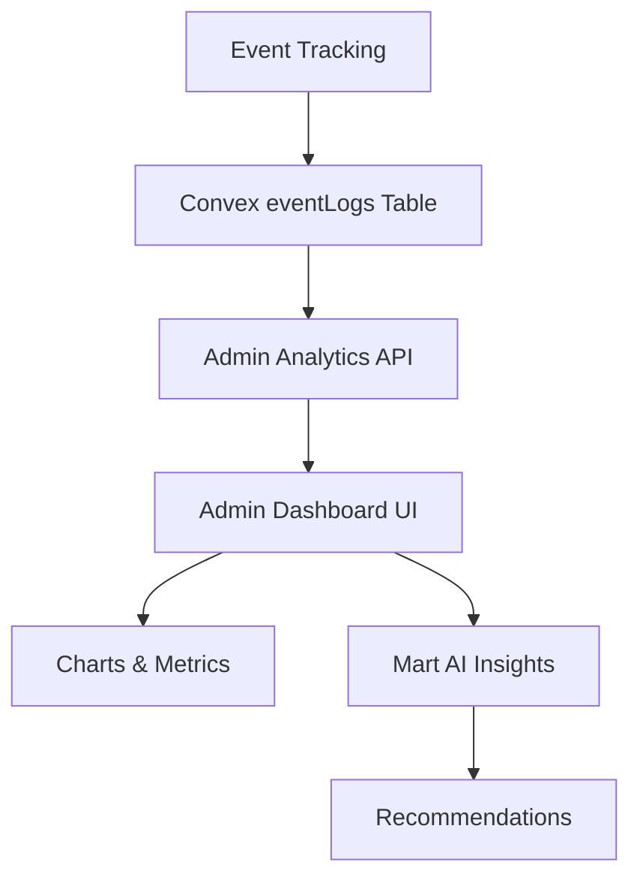

# Admin Analytics Dashboard - Low Level Design

## Problem Statement

Super admins need visibility into:

- User behavior and funnel metrics
- Feature adoption rates
- Drop-off points requiring intervention
- AI-powered recommendations for product improvements

---

## Solution: Admin BI Dashboard with Mart AI



---

## Features

### 1. Funnel Visualization

Show conversion at each step:

```
Signup → Onboarding → GSC Connected → Keywords → Clusters → Briefs → Published
  100%      80%           30%            25%        20%       10%       4%
```

### 2. Trend Charts

- Daily/Weekly/Monthly active users
- Feature usage over time
- Error rates by type
- AI request latency

### 3. Cohort Analysis

- Retention by signup month
- Feature adoption by user segment
- LTV by acquisition source

### 4. Mart AI Insights

AI-powered analysis:

> "GSC connection has 50% drop-off. Recommend adding step-by-step guide or video tutorial."

> "Users who generate clusters within 24h of signup have 3x higher retention."

---

## Schema Changes

```typescript
// convex/schema.ts additions

eventLogs: defineTable({
  userId: v.optional(v.id('users')),
  sessionId: v.optional(v.string()),
  event: v.string(),
  properties: v.optional(v.any()),
  timestamp: v.number(),
  url: v.optional(v.string()),
  userAgent: v.optional(v.string()),
})
  .index('by_event', ['event', 'timestamp'])
  .index('by_user', ['userId', 'timestamp'])
  .index('by_timestamp', ['timestamp']),

// Aggregated metrics (computed daily)
dailyMetrics: defineTable({
  date: v.string(), // YYYY-MM-DD
  metric: v.string(), // 'signups', 'activations', etc.
  value: v.number(),
  breakdown: v.optional(v.any()), // { source: 'organic': 50, 'paid': 30 }
})
  .index('by_date_metric', ['date', 'metric']),
```

---

## API Endpoints

| Endpoint               | Description             |
| ---------------------- | ----------------------- |
| `getEventFunnel`       | Funnel conversion rates |
| `getTimeSeriesMetrics` | Charts data over time   |
| `getCohortRetention`   | Retention by cohort     |
| `getAIInsights`        | Mart's recommendations  |
| `getRealtimeStats`     | Live active users       |

---

## UI Components

### Admin Analytics Page

```
/admin/analytics
├── OverviewCards (DAU, WAU, MAU, Revenue)
├── FunnelChart (conversion steps)
├── TrendChart (time series)
├── CohortTable (retention grid)
├── MartInsights (AI recommendations)
└── EventExplorer (raw event search)
```

---

## Mart AI Integration

### Insight Generation

1. Run daily analysis on event data
2. Identify anomalies and patterns
3. Generate actionable recommendations
4. Prioritize by impact potential

### Example Prompts

```
Analyze the following funnel data and identify:
1. Biggest drop-off point
2. Likely causes
3. Recommended actions

Funnel: signup(1000) → project(600) → gsc(200) → keywords(180)
```

### Response Format

```typescript
interface MartInsight {
  id: string;
  type: 'warning' | 'opportunity' | 'trend';
  title: string;
  description: string;
  impact: 'high' | 'medium' | 'low';
  recommendation: string;
  data: Record<string, any>;
  generatedAt: number;
}
```

---

## Access Control

| Role          | Access                      |
| ------------- | --------------------------- |
| `user`        | None                        |
| `admin`       | View only                   |
| `super_admin` | View + Export + AI Insights |

---

## Implementation Order

1. [ ] Add `eventLogs` table to schema
2. [ ] Create `trackServerEvent` mutation
3. [ ] Update `trackEvent` to call mutation
4. [ ] Add `dailyMetrics` aggregation job
5. [ ] Create analytics query APIs
6. [ ] Build admin analytics page
7. [ ] Add funnel chart component
8. [ ] Add trend chart component
9. [ ] Integrate Mart AI insights
10. [ ] Add event explorer

---

## Ticket

| Field            | Value                                      |
| ---------------- | ------------------------------------------ |
| **ID**           | ADMIN-003                                  |
| **Title**        | Admin Analytics Dashboard with AI Insights |
| **Priority**     | P1                                         |
| **Story Points** | 13                                         |
| **Dependencies** | UX-006 (Analytics Events)                  |

---

## Board Approval

| Persona   | Input                                                                       |
| --------- | --------------------------------------------------------------------------- |
| **BILL**  | "Finally can see CAC payback. Add LTV projections."                         |
| **CLARA** | "Show acquisition source breakdown. I need channel attribution."            |
| **KHANH** | "Aggregate daily, don't query raw events in real-time. Performance matter." |
| **KATE**  | "Start with funnel. That's highest value for product decisions."            |
| **MART**  | "I can analyze patterns you miss. Let me help!"                             |

**Confidence**: 0.85
