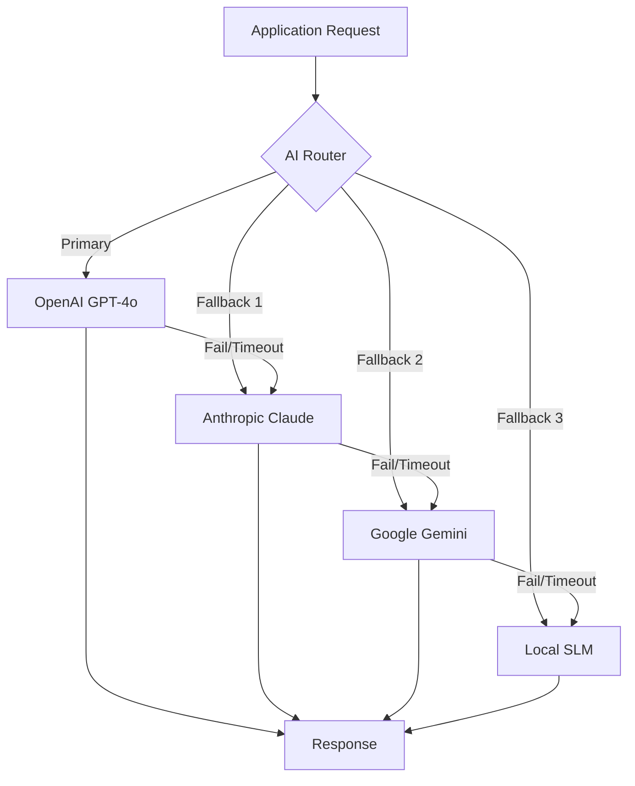

# Multi-AI Provider Intelligence Layer - Low Level Design

## Problem Statement

**Single Point of Failure**: MartAI currently depends solely on OpenAI for all AI operations. If OpenAI experiences:

- API outages
- Rate limiting
- Degraded performance
- Price increases

...the entire application becomes non-functional.

---

## Solution: Multi-Provider AI Layer



---

## Supported Providers

| Provider      | Model             | Use Case                        | Cost | Speed     |
| ------------- | ----------------- | ------------------------------- | ---- | --------- |
| **OpenAI**    | GPT-4o            | Complex reasoning, SEO analysis | $$$  | Fast      |
| **Anthropic** | Claude 3.5 Sonnet | Long-form content, briefs       | $$$  | Fast      |
| **Google**    | Gemini 1.5 Flash  | Quick tasks, cheap fallback     | $    | Very Fast |
| **Local**     | Ollama/LLama      | Offline fallback, privacy       | Free | Varies    |

---

## Architecture

### 1. AI Provider Interface

```typescript
interface AIProvider {
  name: 'openai' | 'anthropic' | 'gemini' | 'ollama';
  call(params: AIRequest): Promise<AIResponse>;
  isHealthy(): Promise<boolean>;
  estimateCost(tokens: number): number;
}

interface AIRequest {
  messages: Message[];
  model?: string;
  temperature?: number;
  maxTokens?: number;
  stream?: boolean;
}

interface AIResponse {
  content: string;
  usage: { promptTokens: number; completionTokens: number };
  provider: string;
  model: string;
  latencyMs: number;
}
```

### 2. AI Router with Fallback

```typescript
class AIRouter {
  private providers: AIProvider[];
  private healthStatus: Map<string, boolean>;
  private circuitBreaker: Map<string, CircuitBreaker>;

  async call(request: AIRequest, options?: RouterOptions): Promise<AIResponse> {
    const orderedProviders = this.getOrderedProviders(options);

    for (const provider of orderedProviders) {
      if (!this.isProviderAvailable(provider)) continue;

      try {
        const response = await this.callWithTimeout(provider, request);
        this.recordSuccess(provider);
        return response;
      } catch (error) {
        this.recordFailure(provider, error);
        continue; // Try next provider
      }
    }

    throw new AllProvidersFailedError();
  }
}
```

### 3. Circuit Breaker Pattern

```typescript
interface CircuitBreaker {
  state: 'closed' | 'open' | 'half-open';
  failureCount: number;
  lastFailure: number;
  successCount: number;
}

// Rules:
// - After 3 failures in 60s: Open circuit (skip provider)
// - After 30s open: Half-open (try one request)
// - On success in half-open: Close circuit
// - On failure in half-open: Reopen for 60s
```

---

## Routing Strategies

| Strategy              | Description                                 | Use Case       |
| --------------------- | ------------------------------------------- | -------------- |
| **Priority**          | Try providers in order, fallback on failure | Default        |
| **Cost-Optimized**    | Use cheapest healthy provider first         | High volume    |
| **Quality-First**     | Use best model, expensive fallback          | Critical tasks |
| **Latency-Optimized** | Route to fastest responding provider        | Real-time      |
| **Round-Robin**       | Distribute load across providers            | Load balancing |

---

## Task-Based Routing

| Task Type                | Primary      | Fallback 1  | Fallback 2 |
| ------------------------ | ------------ | ----------- | ---------- |
| **SEO Analysis**         | GPT-4o       | Claude 3.5  | Gemini 1.5 |
| **Brief Generation**     | Claude 3.5   | GPT-4o      | Gemini 1.5 |
| **Keyword Clustering**   | GPT-4o       | Gemini 1.5  | Claude 3   |
| **Quick Classification** | Gemini Flash | GPT-4o-mini | Local SLM  |
| **Long Content**         | Claude 3.5   | GPT-4o      | -          |

---

## Environment Variables

```env
# Primary
OPENAI_API_KEY=sk-...

# Fallbacks
ANTHROPIC_API_KEY=sk-ant-...
GOOGLE_AI_API_KEY=AIza...
OLLAMA_URL=http://localhost:11434

# Router Config
AI_PRIMARY_PROVIDER=openai
AI_FALLBACK_ENABLED=true
AI_TIMEOUT_MS=30000
AI_CIRCUIT_BREAKER_THRESHOLD=3
```

---

## Monitoring & Observability

### Metrics to Track

| Metric                  | Description                  | Alert Threshold |
| ----------------------- | ---------------------------- | --------------- |
| `ai_request_latency_ms` | Response time per provider   | > 10s           |
| `ai_request_errors`     | Failed requests per provider | > 10%           |
| `ai_fallback_triggered` | Times fallback was used      | > 5/min         |
| `ai_circuit_open`       | Provider circuit opened      | Any             |
| `ai_cost_usd`           | Spend per provider per day   | Budget limit    |

### Health Check Endpoint

```typescript
// GET /api/health/ai
{
  "status": "healthy",
  "providers": {
    "openai": { "status": "up", "latencyMs": 234, "circuitState": "closed" },
    "anthropic": { "status": "up", "latencyMs": 456, "circuitState": "closed" },
    "gemini": { "status": "up", "latencyMs": 123, "circuitState": "closed" },
    "ollama": { "status": "down", "error": "Connection refused" }
  },
  "primaryProvider": "openai",
  "fallbacksAvailable": 2
}
```

---

## Implementation Order

1. [ ] Create `AIProvider` interface and base class
2. [ ] Implement `OpenAIProvider` (refactor existing)
3. [ ] Implement `AnthropicProvider`
4. [ ] Implement `GeminiProvider`
5. [ ] Create `AIRouter` with fallback logic
6. [ ] Add circuit breaker pattern
7. [ ] Add health check endpoint
8. [ ] Add cost tracking and alerts
9. [ ] Implement task-based routing
10. [ ] Add admin dashboard for provider status

---

## Schema Changes

```typescript
// convex/schema.ts additions

aiProviderLogs: defineTable({
  provider: v.string(), // 'openai' | 'anthropic' | 'gemini' | 'ollama'
  model: v.string(),
  taskType: v.string(), // 'seo_analysis' | 'brief_generation' | etc
  success: v.boolean(),
  latencyMs: v.number(),
  promptTokens: v.number(),
  completionTokens: v.number(),
  costUsd: v.optional(v.number()),
  errorMessage: v.optional(v.string()),
  createdAt: v.number(),
})
  .index('by_provider', ['provider', 'createdAt'])
  .index('by_task', ['taskType', 'createdAt']),

aiProviderHealth: defineTable({
  provider: v.string(),
  status: v.string(), // 'up' | 'down' | 'degraded'
  circuitState: v.string(), // 'closed' | 'open' | 'half-open'
  failureCount: v.number(),
  lastCheck: v.number(),
  lastFailure: v.optional(v.number()),
  avgLatencyMs: v.optional(v.number()),
})
  .index('by_provider', ['provider']),
```

---

## Existing Code to Refactor

| File                                  | Change                                 |
| ------------------------------------- | -------------------------------------- |
| `convex/lib/services/intelligence.ts` | Use AIRouter instead of direct OpenAI  |
| `convex/ai/seoAgent.ts`               | Use AIRouter                           |
| `convex/ai/analysis.ts`               | Use AIRouter                           |
| `lib/openai.ts`                       | Rename to `lib/ai/providers/openai.ts` |

---

## Board Approval

| Persona   | Input                                                             |
| --------- | ----------------------------------------------------------------- |
| **TYLER** | "Critical for reliability. Circuit breaker is industry standard." |
| **KHANH** | "Keep provider implementations isolated. DI pattern."             |
| **BILL**  | "Track cost per provider. Set budget alerts."                     |
| **OSCAR** | "Need runbook for when all providers fail."                       |
| **SAM**   | "Test each provider independently. Mock failures."                |

**Confidence**: 0.9 (Research-backed, proven patterns)

---

## Ticket

| Field            | Value                   |
| ---------------- | ----------------------- |
| **ID**           | AI-001                  |
| **Title**        | Multi-Provider AI Layer |
| **Priority**     | P1                      |
| **Story Points** | 13                      |
| **Sprint**       | 3                       |

---

## References

- [Portkey AI Gateway](https://portkey.ai)
- [LiteLLM - Multi-provider SDK](https://litellm.ai)
- [Circuit Breaker Pattern](https://martinfowler.com/bliki/CircuitBreaker.html)
