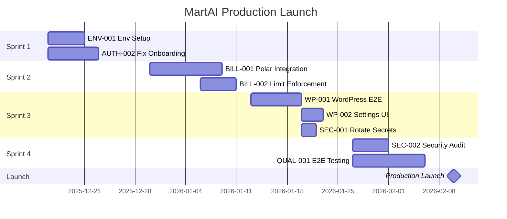

# MartAI Production Launch Plan

**Created**: December 12, 2025  
**Target Launch**: Mid-February 2026  
**Total Effort**: 50 story points / 4 sprints (8 weeks)

---

## Ticket Summary

| ID              | Title                                 | Pts | Sprint | Status         |
| --------------- | ------------------------------------- | --- | ------ | -------------- |
| ENV-001         | Environment Variable Setup            | 2   | 1      | ✅ Done        |
| AUTH-002        | Fix Onboarding Keyword/MR             | 3   | 1      | ✅ Done        |
| ADMIN-001       | Fix View User Button                  | 1   | 1      | ✅ Done        |
| **RESEND-001**  | **Set Resend API Key**                | 1   | 1      | ✅ Done        |
| **AGENT-001**   | **Generate Convex Types for Agent**   | 1   | 1      | ✅ Done        |
| **RESEND-002**  | **Add Magic Link UI**                 | 2   | 1      | ✅ Done        |
| BILL-001        | Polar Billing Integration             | 8   | 2      | 🔲 Todo        |
| BILL-002        | Subscription Limit Enforcement        | 5   | 2      | 🔲 Todo        |
| ADMIN-002       | Enhance User Detail Page              | 5   | 2      | ✅ Done        |
| WP-001          | WordPress E2E Testing                 | 5   | 3      | 🔲 Todo        |
| WP-002          | WordPress Settings UI                 | 3   | 3      | 🔲 Todo        |
| SEC-001         | Rotate All Secrets                    | 2   | 3      | 🔲 Todo        |
| ADMIN-003       | User Engagement Milestones            | 3   | 3      | ✅ Done        |
| SEC-002         | Security Audit Checklist              | 5   | 4      | 🔲 Todo        |
| QUAL-001        | Critical Path E2E Testing             | 8   | 4      | 🔲 Todo        |
| **TEST-001**    | **Unit Test Coverage Roadmap**        | 8   | 3      | 🔲 Todo        |
| **PROJ-001**    | **Project Type + SERP Gating**        | 5   | 2      | ✅ Done        |
| **CODE-002**    | **useProject Hook Migration**         | 3   | 1      | ✅ Done        |
| **PROFILE-001** | **User Profile Page**                 | 2   | 1      | ✅ Done        |
| NOTIFY-001      | Notification System                   | 5   | 4      | 🔲 Todo        |
| **CAL-001**     | **Content Calendar Feature**          | 8   | 2      | ✅ Done        |
| **QW-001**      | **Quick Wins Dashboard Card**         | 3   | 2      | 🔜 In Progress |
| **UX-001**      | **Phase-Based User Flow**             | 8   | 2      | 🔲 Todo        |
| **UX-002**      | **Mart Guide Component**              | 5   | 3      | 🔲 Todo        |
| **UX-003**      | **Empty State Designs**               | 5   | 3      | 🔲 Todo        |
| **UX-004**      | **Error Handling Flows**              | 3   | 3      | 🔲 Todo        |
| **UX-005**      | **Accessibility (WCAG 2.1 AA)**       | 5   | 4      | 🔲 Todo        |
| **UX-006**      | **Analytics Event Tracking**          | 3   | 4      | 🔲 Todo        |
| **UX-007**      | **Email Notification Triggers**       | 5   | 4      | 🔲 Todo        |
| BLOG-001        | Public Blog for SEO/Content Marketing | 8   | 5      | 🔲 Todo        |

---

## Executive Summary

MartAI is feature-complete for MVP. This plan addresses 9 production blockers in dependency order, plus environment setup and security requirements.

> [!IMPORTANT]
> All tickets are P0 (must-have for launch). Future features are deferred post-launch.

---

## Board of Directors Approval

| Persona   | Input                                                 |
| --------- | ----------------------------------------------------- |
| **MART**  | Fix onboarding first - user value is #1 priority      |
| **KATE**  | 4 sprints is realistic. Don't cut corners on billing. |
| **BILL**  | No revenue without Polar. This is critical path.      |
| **KHANH** | Security audit non-negotiable. Rotate all secrets.    |
| **SAM**   | E2E tests required before launch. No manual QA only.  |
| **BARRY** | Need working demo by Sprint 3 for sales calls.        |

**Confidence**: 0.9 (High - all personas agree)

---

## Production Backlog (Ordered by Dependencies)

### Sprint 1: Foundation (Week 1-2)

---

#### ENV-001: Environment Variable Setup & Documentation

| Field            | Value             |
| ---------------- | ----------------- |
| **Priority**     | P0                |
| **Story Points** | 2                 |
| **Dependencies** | None (Start here) |

**User Story**:

> As a DevOps engineer deploying MartAI, I want clear documentation of all required environment variables so that I can deploy to production without guessing.

**Definition of Ready**:

- [ ] Current `.env.example` reviewed
- [ ] All services identified (Convex, OpenAI, Polar, Google, WordPress)
- [ ] Production URLs known

**Acceptance Criteria**:

```gherkin
Given I am setting up production deployment
When I follow the ENV_SETUP.md guide
Then all required variables are documented with:
  - Description of what each var does
  - Where to get the value (console URL)
  - Command to generate secrets
```

**Definition of Done**:

- [ ] `docs/ENV_SETUP.md` created with step-by-step guide
- [ ] `.env.example` updated with all production vars
- [ ] Secret generation commands documented
- [ ] Tested by deploying to Vercel staging

---

#### AUTH-002: Fix Onboarding Keyword & MR Generation

| Field            | Value |
| ---------------- | ----- |
| **Priority**     | P0    |
| **Story Points** | 3     |
| **Dependencies** | None  |

**User Story**:

> As a new user completing onboarding, I want keywords and MR score generated automatically so that I see value immediately after signup.

**Definition of Ready**:

- [ ] Current onboarding flow traced
- [ ] Toast notifications added (done)
- [ ] Convex logs accessible

**Acceptance Criteria**:

```gherkin
Given I complete onboarding with website "example.com"
When the project is created
Then:
  - At least 8 keywords are generated
  - MR score shows a number (not "-")
  - Success toast appears
```

**Definition of Done**:

- [ ] Keywords generated 100% of the time after onboarding
- [ ] MR score > 0 after onboarding
- [ ] No console errors during flow
- [ ] Tested with 3 different website URLs

---

#### ADMIN-001: Fix View User Button in Admin Portal

| Field            | Value |
| ---------------- | ----- |
| **Priority**     | P0    |
| **Story Points** | 1     |
| **Dependencies** | None  |

**User Story**:

> As an admin, I want the View User button in the users table to navigate to the user detail page so that I can manage individual users.

**Root Cause**:

The `IconButton` uses `as="a"` pattern which doesn't work properly with Next.js App Router. Should use Next.js `Link` component.

**Acceptance Criteria**:

```gherkin
Given I am on the Admin Users page
When I click the View icon for any user
Then I navigate to /admin/users/[userId] detail page
```

**Definition of Done**:

- [ ] Replace `as="a"` with Next.js Link wrapper
- [ ] Remove Reset button from users table (keep only on detail page)
- [ ] Verify navigation works in Firefox, Chrome, Safari
- [ ] No console errors

---

### Sprint 2: Billing (Week 3-4)

---

#### BILL-001: Polar Billing Integration

| Field            | Value   |
| ---------------- | ------- |
| **Priority**     | P0      |
| **Story Points** | 8       |
| **Dependencies** | ENV-001 |

**User Story**:

> As a business owner, I want users to subscribe and pay for their tier so that we generate revenue.

**Definition of Ready**:

- [ ] Polar account created
- [ ] Product tiers defined (Solo $49, Growth $149)
- [ ] `@convex-dev/polar` component installed (done)
- [ ] Polar API keys in `.env`

**Acceptance Criteria**:

```gherkin
Given I am a free user
When I click "Upgrade to Growth"
Then:
  - Polar checkout flow opens
  - After payment, my tier updates to "growth"
  - Rate limits reflect new tier

Given I am a paying subscriber
When I view my account
Then I see my current plan and billing date
```

**Definition of Done**:

- [ ] Checkout flow works end-to-end
- [ ] Subscription stored in Convex
- [ ] Webhook handles subscription events
- [ ] Cancellation flow works
- [ ] Tested in Polar sandbox mode

---

#### BILL-002: Subscription Limit Enforcement

| Field            | Value    |
| ---------------- | -------- |
| **Priority**     | P0       |
| **Story Points** | 5        |
| **Dependencies** | BILL-001 |

**User Story**:

> As a paying customer, I want my tier limits enforced fairly so that I get what I pay for.

**Definition of Ready**:

- [ ] Tier limits defined (Solo: 1 project, Growth: 3 projects)
- [ ] Rate limiter configured per tier
- [ ] BILL-001 complete

**Acceptance Criteria**:

```gherkin
Given I am on Solo tier
When I try to create a second project
Then I see "Upgrade to create more projects" message

Given I am on Growth tier
When I generate keywords
Then rate limit is 500/hour (not 100/hour)
```

**Definition of Done**:

- [ ] Project limits enforced
- [ ] Rate limits vary by tier
- [ ] Upgrade CTAs shown at limit
- [ ] Grace period for downgrade (30 days)

---

#### ADMIN-002: Enhance User Detail Page

| Field            | Value     |
| ---------------- | --------- |
| **Priority**     | P0        |
| **Story Points** | 5         |
| **Dependencies** | ADMIN-001 |

**User Story**:

> As a support admin, I want a comprehensive user detail page so that I can manage users without engineering help.

**Definition of Ready**:

- [ ] ADMIN-001 complete (navigation works)
- [ ] User schema understood
- [ ] Admin mutations identified

**Acceptance Criteria**:

```gherkin
Given I am on a user's detail page
When I view the page
Then I see:
  - User header (avatar, name, email, role, status)
  - Quick stats (plan, projects, engagement score)
  - Onboarding journey progress
  - All user projects listed
  - Action buttons for user management

Given I am on a user's detail page
When I click "Reset Onboarding"
Then the user's onboarding state is reset
  And a confirmation toast appears
```

**Definition of Done**:

- [ ] Reset Onboarding moved from table to detail page only
- [ ] User engagement milestones displayed (if available)
- [ ] All projects listed with links
- [ ] Danger zone section for destructive actions
- [ ] Confirmation modals for state changes

---

### Sprint 3: WordPress Publishing (Week 5-6)

---

#### WP-001: WordPress Integration E2E Testing

| Field            | Value    |
| ---------------- | -------- |
| **Priority**     | P0       |
| **Story Points** | 5        |
| **Dependencies** | AUTH-002 |

**User Story**:

> As a content creator, I want to publish drafts directly to my WordPress site so that I don't have to copy/paste content.

**Definition of Ready**:

- [ ] WordPress test site available
- [ ] WordPress OAuth apps created
- [ ] Content mappers implemented (done)

**Acceptance Criteria**:

```gherkin
Given I have connected my WordPress site
When I click "Publish to WordPress" on a draft
Then:
  - Post appears on my WordPress site
  - Featured image is uploaded
  - Categories/tags are applied
  - Success toast shows post URL
```

**Definition of Done**:

- [ ] Publish flow works with real WordPress site
- [ ] Error handling for connection issues
- [ ] Draft/Publish/Schedule options work
- [ ] Documented in user guide

---

#### WP-002: Wire WordPressConnect to Settings Page

| Field            | Value  |
| ---------------- | ------ |
| **Priority**     | P0     |
| **Story Points** | 3      |
| **Dependencies** | WP-001 |

**User Story**:

> As a user with a WordPress site, I want to connect my site from settings so that I can enable publishing.

**Definition of Ready**:

- [ ] `WordPressConnect` component exists (done)
- [ ] WP-001 tested and working

**Acceptance Criteria**:

```gherkin
Given I am on the Settings page
When I click "Connect WordPress"
Then OAuth flow starts and returns to Settings with connected status
```

**Definition of Done**:

- [ ] WordPress section added to Settings page
- [ ] Connect/Disconnect buttons work
- [ ] Connected site URL displayed
- [ ] Error states handled

---

#### SEC-001: Rotate All Secrets Before Launch

| Field            | Value   |
| ---------------- | ------- |
| **Priority**     | P0      |
| **Story Points** | 2       |
| **Dependencies** | ENV-001 |

**User Story**:

> As a security officer, I want all production secrets rotated from dev values so that we don't launch with compromised credentials.

**Definition of Ready**:

- [ ] List of all secrets in `.env.example`
- [ ] Access to all third-party consoles

**Acceptance Criteria**:

```gherkin
Given I am preparing for production launch
When I run the secret rotation checklist
Then all secrets are:
  - Newly generated (not from dev)
  - Stored in Vercel env vars
  - Removed from any git history
```

**Definition of Done**:

- [ ] All secrets regenerated
- [ ] Old secrets revoked where possible
- [ ] Vercel env vars updated
- [ ] Checklist documented

---

#### ADMIN-003: User Engagement Milestones Schema

| Field            | Value     |
| ---------------- | --------- |
| **Priority**     | P1        |
| **Story Points** | 3         |
| **Dependencies** | ADMIN-002 |

**User Story**:

> As a product manager, I want to track user engagement milestones so that we can analyze activation funnels and identify dropoff points.

**Board of Directors Input**:

- **CLARA (CMO)**: Critical for AARRR metrics - need first keyword → cluster → brief → draft → publish funnel
- **BILL (CFO)**: Enables LTV prediction based on engagement velocity
- **OSCAR (COO)**: Helps support identify where users get stuck

**Definition of Ready**:

- [ ] Schema design approved
- [ ] Triggering events identified
- [ ] Admin detail page ready to display milestones

**Schema Design**:

```typescript
engagementMilestones: v.optional(
  v.object({
    firstKeywordCreatedAt: v.optional(v.number()),
    firstClusterCreatedAt: v.optional(v.number()),
    firstBriefCreatedAt: v.optional(v.number()),
    firstDraftCreatedAt: v.optional(v.number()),
    firstContentPublishedAt: v.optional(v.number()),
    firstGa4ConnectedAt: v.optional(v.number()),
    firstGscConnectedAt: v.optional(v.number()),
    firstWordPressConnectedAt: v.optional(v.number()),
    totalKeywords: v.optional(v.number()),
    totalClusters: v.optional(v.number()),
    totalBriefs: v.optional(v.number()),
    totalDrafts: v.optional(v.number()),
    totalPublished: v.optional(v.number()),
  })
);
```

**Acceptance Criteria**:

```gherkin
Given a user creates their first keyword
When the keyword is saved
Then the user's firstKeywordCreatedAt is set (if not already set)
  And totalKeywords is incremented

Given I view a user in the admin portal
When the user has engagement milestones
Then I see a timeline of their journey with timestamps
```

**Definition of Done**:

- [ ] Schema extended with engagementMilestones
- [ ] Triggers added to keyword, cluster, brief, draft, publish actions
- [ ] Milestones displayed on admin user detail page
- [ ] Existing users backfilled where data exists

---

### Sprint 4: Security & QA (Week 7-8)

---

#### SEC-002: Security Audit Checklist

| Field            | Value   |
| ---------------- | ------- |
| **Priority**     | P0      |
| **Story Points** | 5       |
| **Dependencies** | SEC-001 |

**User Story**:

> As a product owner, I want a security review completed so that we don't expose customer data.

**Definition of Ready**:

- [ ] All secrets rotated (SEC-001)
- [ ] OWASP Top 10 checklist available

**Acceptance Criteria**:

```gherkin
Given I am reviewing security before launch
When I complete the audit checklist
Then I have verified:
  - No secrets in git history
  - CORS configured correctly
  - Rate limiting active
  - API endpoints authenticated
  - No SQL injection risks
  - XSS protections in place
```

**Definition of Done**:

- [ ] Audit checklist document created
- [ ] All items verified
- [ ] Any issues fixed
- [ ] Sign-off from team lead

---

#### TEST-001: Unit Test Coverage Roadmap

| Field            | Value                             |
| ---------------- | --------------------------------- |
| **Priority**     | P1                                |
| **Story Points** | 8                                 |
| **Dependencies** | None                              |
| **LDD**          | `docs/business/BUSINESS_LOGIC.md` |

**User Story**:

> As a development team, we want comprehensive unit test coverage so that we can refactor with confidence and catch bugs before production.

**Current State**:

| Type      | Count   | Tested  | Coverage |
| --------- | ------- | ------- | -------- |
| Queries   | 119     | ~25     | **21%**  |
| Mutations | 114     | ~30     | **26%**  |
| Actions   | 48      | ~10     | **21%**  |
| **Total** | **281** | **~65** | **23%**  |

**Definition of Ready**:

- [x] Current coverage analyzed
- [x] BUSINESS_LOGIC.md created with test plan
- [ ] Testing priorities defined

**Acceptance Criteria**:

```gherkin
# P0: Core Business Logic (Target: 80%)
Given I am testing core business logic
When I run the test suite
Then the following modules have 80%+ coverage:
  - Keywords CRUD
  - Clusters CRUD
  - Briefs CRUD
  - Phoo Rating calculation
  - Phase transitions
  - M1 workflow

# P1: Security (Target: 100%)
Given I am testing security-critical functions
When I run the test suite
Then the following have 100% coverage:
  - RBAC data isolation
  - Authentication flows
  - Rate limit enforcement
  - API key validation

# P2: Integrations (Target: 50%)
Given I am testing integrations
When I run the test suite
Then the following have 50%+ coverage:
  - OAuth flows (GA4, GSC)
  - WordPress publishing
  - Webhook handlers
```

**Definition of Done**:

- [ ] Core logic tests at 80%+ coverage
- [ ] Security tests at 100% coverage
- [ ] Integration tests at 50%+ coverage
- [ ] All tests pass in CI
- [ ] Coverage report generated

---

#### QUAL-001: Critical Path E2E Testing

| Field            | Value            |
| ---------------- | ---------------- |
| **Priority**     | P0               |
| **Story Points** | 8                |
| **Dependencies** | WP-002, AUTH-002 |

**User Story**:

> As a QA engineer, I want documented test cases for the full user journey so that we catch regressions before launch.

**Definition of Ready**:

- [ ] All prior tickets complete
- [ ] Test account credentials available
- [ ] Production-like staging environment

**Acceptance Criteria**:

```gherkin
Given I have the E2E test suite
When I run through all test cases
Then I have verified:
  - Signup → Onboarding → Home (keywords visible)
  - Strategy → Keywords → Clusters → Briefs
  - Briefs → Drafts → WordPress Publish
  - Billing → Upgrade → Limits enforced
```

**Definition of Done**:

- [ ] Test cases documented
- [ ] All paths tested manually
- [ ] Critical bugs fixed
- [ ] Test results logged
- [ ] Go/No-Go decision documented

---

## Environment Variable Setup Guide

### Required for Production

| Variable                 | Description           | How to Get                                              |
| ------------------------ | --------------------- | ------------------------------------------------------- |
| `NEXT_PUBLIC_CONVEX_URL` | Convex deployment URL | [Convex Dashboard](https://dashboard.convex.dev)        |
| `CONVEX_DEPLOYMENT`      | Deployment name       | Convex Dashboard                                        |
| `OPENAI_API_KEY`         | OpenAI API key        | [OpenAI Platform](https://platform.openai.com/api-keys) |
| `JWT_SECRET`             | JWT signing secret    | Generate (see below)                                    |
| `JWT_REFRESH_SECRET`     | Refresh token secret  | Generate                                                |
| `CSRF_SECRET`            | CSRF protection       | Generate                                                |
| `CRON_SECRET`            | Cron job auth         | Generate                                                |

### Generate Secrets

```bash
# Run this for each secret you need
node -e "console.log(require('crypto').randomBytes(32).toString('hex'))"
```

### Required for Billing (Polar)

| Variable                | Description          | How to Get                                   |
| ----------------------- | -------------------- | -------------------------------------------- |
| `POLAR_ACCESS_TOKEN`    | Polar API token      | [Polar Dashboard](https://polar.sh/settings) |
| `POLAR_WEBHOOK_SECRET`  | Webhook verification | Polar webhook settings                       |
| `POLAR_ORGANIZATION_ID` | Your org ID          | Polar Dashboard                              |

### Required for WordPress

| Variable                  | Description  | How to Get                                                   |
| ------------------------- | ------------ | ------------------------------------------------------------ |
| `WORDPRESS_CLIENT_ID`     | OAuth app ID | [WordPress Developer](https://developer.wordpress.com/apps/) |
| `WORDPRESS_CLIENT_SECRET` | OAuth secret | Same as above                                                |

### Required for Google Analytics/GSC

| Variable               | Description     | How to Get                                                                |
| ---------------------- | --------------- | ------------------------------------------------------------------------- |
| `GOOGLE_CLIENT_ID`     | OAuth client ID | [Google Cloud Console](https://console.cloud.google.com/apis/credentials) |
| `GOOGLE_CLIENT_SECRET` | OAuth secret    | Same as above                                                             |

---

## Timeline



---

## Future State (Post-Launch P1/P2)

### Admin Portal User Management

| Ticket    | Description                          | Priority | Points |
| --------- | ------------------------------------ | -------- | ------ |
| ADMIN-004 | Account Management (password, email) | P1       | 5      |
| ADMIN-005 | Subscription Management              | P1       | 5      |
| ADMIN-006 | Admin Audit Logs                     | P1       | 5      |
| ADMIN-007 | BI Dashboard - Engagement Funnel     | P2       | 8      |
| ADMIN-008 | User Impersonation (Non-Prod Only)   | P1       | 8      |

> [!WARNING]
> **ADMIN-008 requires BOD review before implementation.** This feature allows admins to log in as users for debugging/support. Security-sensitive - must be blocked in production environment.

### Integrations & Platform

| Ticket   | Description              | Priority | Points |
| -------- | ------------------------ | -------- | ------ |
| ACT-001  | Activity Logs for Orgs   | P1       | 5      |
| API-002  | Swagger UI for Docs      | P2       | 3      |
| WEB-001  | Webflow Integration      | P2       | 8      |
| SHOP-001 | Shopify Integration      | P2       | 8      |
| PERF-001 | Performance Optimization | P2       | 5      |

### UX Polish

| Ticket | Description                           | Priority | Points |
| ------ | ------------------------------------- | -------- | ------ |
| UX-001 | Skeleton Loading (35 pages)           | P1       | 8      |
| UX-002 | Smooth Transitions & Micro-animations | P2       | 5      |
| UX-003 | Full Component Extraction Audit       | P1       | 8      |

> [!NOTE]
> **UX-001**: Replace all spinner/loading text with dimension-matched skeleton components.
> **UX-003**: Audit all 35 pages for component extraction. Target: max 150 lines/page, full reuse of shared components.

### SERP & Competitor Analysis

| Ticket   | Description                      | Priority | Points |
| -------- | -------------------------------- | -------- | ------ |
| SERP-001 | SERP during onboarding URL input | P1       | 5      |
| SERP-002 | Flow SERP data to strategy pages | P1       | 5      |
| SERP-003 | Admin portal URL analyzer tool   | P1       | 3      |

> [!NOTE]
> **Business Model**: Members analyze competitor URLs by creating new projects. Each project = 1 URL through analyzer. Project limits tied to subscription tier (upsell path).
> **SERP-001**: Auto-run SERP when URL is input during onboarding, store results.
> **SERP-002**: Display SERP competitor data in strategy, keywords, and content pages.

### Project Type & SERP Gating (PROJ-001)

| Field    | Value |
| -------- | ----- |
| Priority | P1    |
| Points   | 5     |
| Sprint   | 2     |

**Requirements:**

1. Add `projectType: 'own' | 'competitor'` field to projects schema
2. Lock URL after project creation (no editing allowed)
3. 1 SERP analysis per project included in subscription
4. Additional SERP = one-off charge through Polar
5. `own` = full features (content gen, strategy, analytics)
6. `competitor` = limited view (SERP data only, no generation)

**NO FREE TIER** - All features require paid subscription.

### Code Quality

| Ticket   | Description               | Priority | Points |
| -------- | ------------------------- | -------- | ------ |
| CODE-001 | Extract integration hooks | P2       | 5      |

> [!NOTE]
> **CODE-001**: Create `useGA4Connection`, `useGSCConnection`, `useCMSConnection` hooks to encapsulate OAuth flows, token parsing, and state management.

---

#### UX-001: Phase-Based User Flow

| Field            | Value                           |
| ---------------- | ------------------------------- |
| **Priority**     | P0                              |
| **Story Points** | 8                               |
| **Dependencies** | None                            |
| **LDD**          | `docs/project/USER_FLOW_LDD.md` |

**User Story**:

> As a MartAI user, I want a guided flow for my first project and DIY mode for subsequent projects so that I learn the platform without being slowed down once I'm experienced.

**Definition of Ready**:

- [x] LDD approved (see `docs/project/USER_FLOW_LDD.md`)
- [x] Multi-project flow documented
- [ ] Current sidebar navigation reviewed
- [ ] Phase transitions defined

**Acceptance Criteria**:

```gherkin
# First Project (Guided Mode)
Given I am a new user with no completed projects
When I complete onboarding
Then I should only see routes available for my current phase
And I should see "Next Step" CTAs guiding me forward
And Mart should appear to explain each new page

# Subsequent Projects (DIY Mode)
Given I have completed at least one project
When I create a new project
Then all routes should be unlocked immediately
And I should see a "Need Help?" toggle to re-enable guidance
```

**Definition of Done**:

- [ ] `useUserPhase` hook created (per-project phases)
- [ ] `hasCompletedFirstProject` flag tracked per user
- [ ] Sidebar gating implemented (guided mode)
- [ ] DIY mode unlocks all routes after first project
- [ ] "Need Help?" toggle re-enables guided flow
- [ ] Next Step CTAs on all core pages
- [ ] Mart guide component integrated
- [ ] Phase transitions tested E2E

---

#### UX-002: Mart Guide Component

| Field            | Value                           |
| ---------------- | ------------------------------- |
| **Priority**     | P1                              |
| **Story Points** | 5                               |
| **Dependencies** | UX-001                          |
| **LDD**          | `docs/project/USER_FLOW_LDD.md` |

**User Story**:

> As a new user, I want a friendly guide (Mart) to explain each page so I understand what to do next.

**Acceptance Criteria**:

```gherkin
Given I visit a page for the first time
When the page loads
Then Mart appears with a welcome message
And suggests the next action
And I can dismiss Mart

Given I complete a milestone
When the phase transitions
Then Mart celebrates with animation
```

**Definition of Done**:

- [ ] `MartGuide` component created
- [ ] 6 trigger moments implemented (per LDD)
- [ ] Dismiss + "Don't show again" options
- [ ] Celebration animations on milestones
- [ ] Accessible (ARIA labels, focusable)

---

#### UX-003: Empty State Designs

| Field            | Value                           |
| ---------------- | ------------------------------- |
| **Priority**     | P1                              |
| **Story Points** | 5                               |
| **Dependencies** | None                            |
| **LDD**          | `docs/project/USER_FLOW_LDD.md` |

**User Story**:

> As a new user with no data, I want helpful empty states so I know what to do next instead of seeing blank pages.

**Acceptance Criteria**:

```gherkin
Given I visit /keywords with no keywords
When the page loads
Then I see "No keywords yet" message with Mart illustration
And I see "Add Keywords" or "Connect GSC" CTA

Given I visit /calendar with no briefs
When the page loads
Then I see "Your calendar is clear" message
And I see "Schedule Brief" CTA
```

**Definition of Done**:

- [ ] Empty states for: /keywords, /strategy, /calendar, /analytics, /content
- [ ] Each has: message, Mart illustration, CTA
- [ ] CTAs navigate to correct action

---

#### UX-004: Error Handling Flows

| Field            | Value                           |
| ---------------- | ------------------------------- |
| **Priority**     | P1                              |
| **Story Points** | 3                               |
| **Dependencies** | None                            |
| **LDD**          | `docs/project/USER_FLOW_LDD.md` |

**User Story**:

> As a user encountering an error, I want helpful error messages so I can recover without frustration.

**Acceptance Criteria**:

```gherkin
Given GSC OAuth fails
When an error occurs
Then I see "Couldn't connect to Google" message
And I see "Retry" button and "Help" link

Given AI generation times out
When the request fails
Then I see "Taking longer than expected" message
And the task continues in background
```

**Definition of Done**:

- [ ] Error states for: OAuth, AI timeout, WordPress, network, rate limit
- [ ] Friendly, non-blaming copy
- [ ] Clear recovery actions
- [ ] Errors announced to screen readers

---

#### UX-005: Accessibility (WCAG 2.1 AA)

| Field            | Value                           |
| ---------------- | ------------------------------- |
| **Priority**     | P0                              |
| **Story Points** | 5                               |
| **Dependencies** | None                            |
| **LDD**          | `docs/project/USER_FLOW_LDD.md` |

**User Story**:

> As a user with disabilities, I want the app to be fully accessible so I can use it with assistive technology.

**Acceptance Criteria**:

```gherkin
Given I use keyboard only
When I tab through the app
Then all interactive elements are focusable
And focus order is logical

Given I use a screen reader
When I navigate the app
Then all buttons and icons have ARIA labels
And errors are announced
```

**Definition of Done**:

- [ ] All interactive elements keyboard focusable
- [ ] Visible focus indicators
- [ ] ARIA labels on all buttons, icons, form fields
- [ ] Color contrast ≥ 4.5:1
- [ ] Skip to main content link
- [ ] Alt text on all images
- [ ] Errors announced to screen readers

---

#### UX-006: Analytics Event Tracking

| Field            | Value                           |
| ---------------- | ------------------------------- |
| **Priority**     | P1                              |
| **Story Points** | 3                               |
| **Dependencies** | None                            |
| **LDD**          | `docs/project/USER_FLOW_LDD.md` |

**User Story**:

> As a product manager, I want to track user events so I can analyze the funnel and identify dropoffs.

**Acceptance Criteria**:

```gherkin
Given a user completes signup
When the account is created
Then "signup_complete" event is fired

Given a user unlocks a new phase
When the phase transition occurs
Then "phase_transition" event is fired with phase name
```

**Definition of Done**:

- [ ] 9 key events implemented (per LDD)
- [ ] Events sent to analytics provider (Vercel Analytics or similar)
- [ ] Dashboard for funnel visualization

---

#### UX-007: Email Notification Triggers

| Field            | Value                           |
| ---------------- | ------------------------------- |
| **Priority**     | P1                              |
| **Story Points** | 5                               |
| **Dependencies** | RESEND-001                      |
| **LDD**          | `docs/project/USER_FLOW_LDD.md` |

**User Story**:

> As a user, I want to receive helpful emails that celebrate my progress and remind me to return.

**Acceptance Criteria**:

```gherkin
Given I create an account
When signup completes
Then I receive a welcome email

Given I haven't logged in for 7 days
When the cron job runs
Then I receive a re-engagement email
```

**Definition of Done**:

- [ ] 6 email triggers implemented (per LDD)
- [ ] Emails styled with MartAI branding
- [ ] Unsubscribe option in each email
- [ ] Cron job for inactive user detection

---

## Appendix: Story Point Reference

| Points | Complexity | Example                       |
| ------ | ---------- | ----------------------------- |
| 1      | Trivial    | Fix typo, update copy         |
| 2      | Simple     | Add env var, single component |
| 3      | Small      | New UI section, simple query  |
| 5      | Medium     | New feature, E2E flow         |
| 8      | Large      | Integration, complex logic    |
| 13     | XL         | Major new system              |
