# MartAI User Flow - Low Level Design

## Current Problem

**Cyclical Routes**: Users can navigate anywhere at any time, leading to confusion:

- `/dashboard` → `/strategy` → `/keywords` → `/calendar` → `/strategy` → ???
- No clear "next step" guidance
- Features available before data exists to support them

---

## Ideal User Journey (with Decision Points)

```mermaid
graph TD
    A[Signup] --> B[Welcome Email Sent]
    B --> C[Onboarding: Personalization]
    C --> D{Connect Data?}
    D -->|Yes GSC/GA4| E[Auto-import Keywords]
    D -->|No, Skip| F[Manual Keywords]
    E --> G{≥10 Keywords?}
    F --> G
    G -->|No| H[Guide: Add More Keywords]
    H --> G
    G -->|Yes| I[Generate Clusters]
    I --> J{Review Clusters?}
    J -->|Edit| K[Cluster Editor]
    J -->|Accept| L[Create Calendar]
    K --> J
    L --> M[Schedule Briefs]
    M --> N[Write First Brief]
    N --> O{WordPress Connected?}
    O -->|Yes| P[Publish]
    O -->|No| Q[Manual Export]
    P --> R[🎉 First Article Published!]
    Q --> R
```



---

## User Goals per Phase

| Phase        | User Goal                      | Success Metric               |
| ------------ | ------------------------------ | ---------------------------- |
| **Setup**    | "Get started quickly"          | Account created in <2 min    |
| **Connect**  | "See my real data"             | GSC/GA4 connected            |
| **Discover** | "Find keywords that rank"      | ≥10 keywords with MR scores  |
| **Plan**     | "Organize my content strategy" | ≥1 cluster, calendar created |
| **Create**   | "Write content that converts"  | First brief completed        |
| **Publish**  | "Go live and track results"    | First article published      |

---

## Phase-Based Access Model

| Phase              | Unlock Condition                     | Available Routes               |
| ------------------ | ------------------------------------ | ------------------------------ |
| **1. Setup**       | Account created                      | `/onboarding`, `/profile`      |
| **2. Connect**     | Onboarding complete                  | + `/settings`, `/integrations` |
| **3. Discover**    | GSC/GA4 connected OR manual keywords | + `/keywords`, `/strategy`     |
| **4. Plan**        | ≥10 keywords, ≥1 cluster             | + `/calendar`                  |
| **5. Create**      | ≥1 brief on calendar                 | + `/content`, `/publish`       |
| **6. Full Access** | First article published              | All routes                     |

---

## Multi-Project User Flow

**Key Insight**: Phase gating applies **per-project**, not per-user.

### User States

```
User State:
├── hasCompletedFirstProject = false → GUIDED FLOW (above phases)
└── hasCompletedFirstProject = true  → PROJECT DASHBOARD
    ├── "+ New Project" → Quick setup (3 fields, no hand-holding)
    ├── "Project A" → Full access, phase = project's current phase
    └── "? Help" → Re-enable guided overlay for this project
```

### Flow Modes

| Mode          | When                     | Behavior                                          |
| ------------- | ------------------------ | ------------------------------------------------- |
| **Guided**    | First project            | Strict phase gating, Mart appears, Next Step CTAs |
| **DIY**       | Subsequent projects      | All routes unlocked, minimal guidance             |
| **Re-Guided** | User clicks "Need Help?" | Guided overlay on current project                 |

---

## UI Changes

### 1. Sidebar Gating

- Grayed out routes user hasn't unlocked
- Tooltip: "Complete X to unlock"
- Progress indicator showing current phase

### 2. Mart as Guide

- Appears on first visit to each page
- Explains what this page does
- Suggests next action
- Celebrates milestones

### 3. Next Step CTA

Every page has a clear "Next" action:

- `/keywords` → "Generate Clusters →"
- `/strategy` → "Create Calendar →"
- `/calendar` → "Write First Brief →"

---

## Mart Personality Guide

| Moment         | Mart Says                                  |
| -------------- | ------------------------------------------ |
| First login    | "Welcome! I'm Mart, your SEO guide."       |
| Phase unlock   | "Nice! You just unlocked [feature]."       |
| First keyword  | "Your first keyword! Now let's find more." |
| First cluster  | "Cluster created! Time to plan content."   |
| First publish  | "🎉 Published! You're officially live."    |
| 7-day inactive | "Ready to pick up where you left off?"     |

---

## Celebration Moments

```
Phase 1 → 2: "Profile set up! ✓" (checkmark animation)
Phase 2 → 3: "Data connected! 🔗" (connection animation)
Phase 3 → 4: "10 keywords! 📊" (progress bar fills)
Phase 4 → 5: "First brief scheduled! 📅" (calendar wiggle)
Phase 5 → 6: "PUBLISHED! 🚀" (confetti + Mart high-five)
```

---

## Email/Notification Triggers

| Trigger         | Email/Notification        | Purpose                   |
| --------------- | ------------------------- | ------------------------- |
| Signup          | Welcome email             | Confirm, set expectations |
| 3 days inactive | "Your keywords miss you"  | Re-engagement             |
| Phase unlock    | "You unlocked [feature]!" | Celebrate progress        |
| 7 days inactive | "Let's get back on track" | Churn prevention          |
| Weekly          | Progress digest           | Show value                |
| First publish   | "Congrats! You're live"   | Celebration               |

---

## Secondary Flows (Future)

| Flow                | Entry Point        | Exit Point            |
| ------------------- | ------------------ | --------------------- |
| **Upgrade**         | Hit limit, see CTA | Payment complete      |
| **Referral**        | Settings page      | Friend signs up       |
| **Cancellation**    | Account settings   | Churn survey + cancel |
| **Feature Release** | New feature modal  | Feature adopted       |

---

## User Segmentation

| Segment          | Characteristics          | Flow Adjustments               |
| ---------------- | ------------------------ | ------------------------------ |
| **Solo Creator** | 1 project, content focus | Simpler calendar, writing tips |
| **Agency**       | Multi-project, team      | Bulk operations, reporting     |
| **Enterprise**   | SSO, compliance          | Admin controls, audit logs     |

---

## Empty State Designs

| Page | When Empty | Message | CTA |
|------|------------|---------|-----|
| `/keywords` | No keywords | "No keywords yet. Let's find what your audience is searching for." | "Add Keywords" or "Connect GSC" |
| `/strategy` | No clusters | "Keywords ready but no clusters. Let's organize your content strategy." | "Generate Clusters" |
| `/calendar` | No scheduled briefs | "Your calendar is clear. Time to plan your first article." | "Schedule Brief" |
| `/analytics` | No GSC connected | "Connect Google Search Console to see your organic performance." | "Connect GSC" |
| `/content` | No briefs | "No briefs to write. Create one from your calendar." | "Go to Calendar" |

> **Design Note**: Each empty state should include a Mart illustration with encouraging copy.

---

## Error Handling Flows

| Error | User Sees | Recovery Action |
|-------|-----------|-----------------|
| GSC OAuth fails | "Couldn't connect to Google. Please try again." | Retry button + help link |
| AI generation timeout | "This is taking longer than expected. We'll notify you when ready." | Background processing + email |
| WordPress publish fails | "Publishing failed. Check your WordPress connection." | Retry + Settings link |
| Network error | "You appear to be offline. Changes will sync when you're back." | Auto-retry on reconnect |
| Rate limit hit | "You've reached your plan limit. Upgrade for more." | Upgrade CTA |

> **Tone**: Errors should be helpful, not blaming. Never say "You did something wrong."

---

## Accessibility Requirements (WCAG 2.1 AA)

| Requirement | Implementation |
|-------------|----------------|
| **Keyboard Navigation** | All interactive elements focusable, logical tab order |
| **Screen Reader** | ARIA labels on all buttons, form fields, icons |
| **Color Contrast** | Minimum 4.5:1 for text, 3:1 for large text |
| **Focus Indicators** | Visible focus ring on all focusable elements |
| **Skip Links** | "Skip to main content" link at top |

| **Alt Text** | All images including Mart illustrations |
| **Form Labels** | Every input has associated label |
| **Error Announcements** | Errors announced to screen readers |

---

## Analytics Event Tracking

| Event | When Fired | Purpose |
|-------|------------|---------|
| `signup_complete` | After account creation | Conversion tracking |
| `onboarding_step_{n}` | Each onboarding step | Dropoff analysis |
| `phase_transition` | User unlocks new phase | Funnel tracking |
| `gsc_connected` | GSC OAuth success | Integration adoption |
| `keywords_added` | Keywords created | Feature usage |
| `cluster_generated` | AI generates clusters | AI feature usage |
| `brief_scheduled` | Brief added to calendar | Calendar adoption |
| `article_published` | First publish | Activation milestone |
| `upgrade_clicked` | User clicks upgrade CTA | Revenue funnel |

---

## Tech Stack

| Component    | Library                   | Purpose                           |
| ------------ | ------------------------- | --------------------------------- |
| Animations   | `framer-motion`           | Page transitions, AnimatePresence |
| Celebrations | `canvas-confetti`         | Milestone confetti                |
| Forms        | `react-hook-form` + `zod` | Multi-step wizards                |

---

## Implementation Order

1. [ ] Create `useUserPhase` hook (per-project phases)
2. [ ] Create `MartGuide` component (mascot + messages)
3. [ ] Create `PhaseProgress` component (sidebar)
4. [ ] Add Framer Motion transitions to page layouts
5. [ ] Add `useCelebration` hook (confetti triggers)
6. [ ] Update Sidebar with gating + progress
7. [ ] Add personalization to onboarding
8. [ ] Set up email triggers (Resend)
9. [ ] Test full flow E2E

---

## Board Approval

| Persona   | Input                                                     |
| --------- | --------------------------------------------------------- |
| **ALEX**  | "This is the product. Linear flow = lower churn."         |
| **PAIGE** | "User goals per phase clarifies success metrics."         |
| **LAURA** | "Decision points diagram is accessibility best practice." |
| **KHANH** | "Phase hook is simple. Low complexity."                   |
| **CLARA** | "Email triggers essential for re-engagement."             |
| **SAM**   | "Easy to test each branch path."                          |

**Confidence**: 0.95 (Research-backed, comprehensive)

---

## Inspiration Sources

- **Duolingo**: Mascot encouragement, streaks, celebrations
- **Linear**: Cinematic transitions, one-input-per-step
- **Notion**: Personalization, pre-filled templates
- **Mailchimp**: Freddie high-five on success
- **Userpilot**: Decision points, branching flows, 7 flow elements
